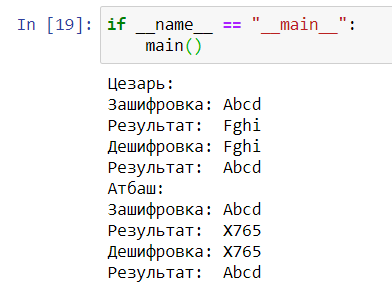

---
## Front matter
lang: ru-RU
title: Шифр простой замены
author: Хитяев Евгений НПМмд-02-21
institute: Российский Университет Дружбы Народов
date: 15 ноября, 2021, Москва, Россия

## Formatting
mainfont: PT Serif
romanfont: PT Serif
sansfont: PT Sans
monofont: PT Mono
toc: false
slide_level: 2
theme: metropolis
header-includes: 
 - \metroset{progressbar=frametitle,sectionpage=progressbar,numbering=fraction}
 - '\makeatletter'
 - '\beamer@ignorenonframefalse'
 - '\makeatother'
aspectratio: 43
section-titles: true

---

# Цели и задачи

## Цель лабораторной работы

Изучение шифрования методом простой замены

# Выполнение лабораторной работы

## Криптография

Криптография (от греч. *тайное письмо*) — наука о математических методах обеспечения конфиденциальности (невозможности прочтения информации посторонним) и аутентичности (целостности и подлинности авторства, а также невозможности отказа от авторства) информации.

В древности криптография вызывала огромный интерес, так как позволяла безопасно передавать информацию.

## Шифр Цезаря
Шифр Цезаря — один из самых простых и наиболее широко известных методов шифрования.

Если сопоставить каждому символу алфавита его порядковый номер (нумеруя с 0), то шифрование и дешифрование можно выразить формулами модульной арифметики:

```
y = (x + k) mod n
x = (y - k + n) mod n
```
где: *x* — символ открытого текста, *y* — символ шифрованного текста, *n* — мощность алфавита, *k* — ключ.

## Шифр Атбаш

Ключ к расшифровке шифра Атбаш прост: первая буква алфавита должна быть заменена на последнюю, вторая – на предпоследнюю и так до последней буквы, которая станет первой. На языке математики эту замену можно представить в с такой формуле: *i* = *n* - *j* + 1,
где *j* – это номер символа, который мы хотим зашифровать, а *n* –  количество всех символов алфавита.

## Контрольный пример

{ #fig:001 width=70% height=70%}

# Выводы

## Результаты выполнения лабораторной работы

В ходе выполнения работы, мне удалось освоить шифрование методом простой замены и реализовать программу для шифрования на языке Python.

