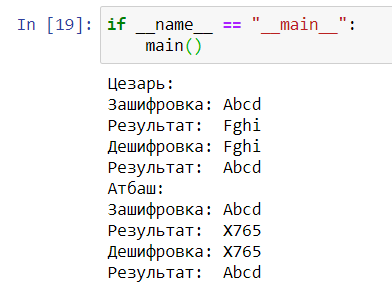

---
# Front matter
title: "Отчёт по лабораторной работе №1"
subtitle: "Шифр простой замены"
author: "Хитяев Евгений НПМмд-02-21"
# Generic otions
lang: ru-RU
toc-title: "Содержание"

# Bibliography
bibliography: bib/cite.bib
csl: pandoc/csl/gost-r-7-0-5-2008-numeric.csl

# Pdf output format
toc: true # Table of contents
toc_depth: 2
lof: true # List of figures
fontsize: 12pt
linestretch: 1.5
papersize: a4
documentclass: scrreprt
## I18n
polyglossia-lang:
  name: russian
  options:
	- spelling=modern
	- babelshorthands=true
polyglossia-otherlangs:
  name: english
### Fonts
mainfont: PT Serif
romanfont: PT Serif
sansfont: PT Sans
monofont: PT Mono
mainfontoptions: Ligatures=TeX
romanfontoptions: Ligatures=TeX
sansfontoptions: Ligatures=TeX,Scale=MatchLowercase
monofontoptions: Scale=MatchLowercase,Scale=0.9
## Biblatex
biblatex: true
biblio-style: "gost-numeric"
biblatexoptions:
  - parentracker=true
  - backend=biber
  - hyperref=auto
  - language=auto
  - autolang=other*
  - citestyle=gost-numeric
## Misc options
indent: true
header-includes:
  - \linepenalty=10 # the penalty added to the badness of each line within a paragraph (no associated penalty node) Increasing the value makes tex try to have fewer lines in the paragraph.
  - \interlinepenalty=0 # value of the penalty (node) added after each line of a paragraph.,
  - \hyphenpenalty=50 # the penalty for line breaking at an automatically inserted hyphen
  - \exhyphenpenalty=50 # the penalty for line breaking at an explicit hyphen
  - \binoppenalty=700 # the penalty for breaking a line at a binary operator
  - \relpenalty=500 # the penalty for breaking a line at a relation
  - \clubpenalty=150 # extra penalty for breaking after first line of a paragraph
  - \widowpenalty=150 # extra penalty for breaking before last line of a paragraph
  - \displaywidowpenalty=50 # extra penalty for breaking before last line before a display math
  - \brokenpenalty=100 # extra penalty for page breaking after a hyphenated line
  - \predisplaypenalty=10000 # penalty for breaking before a display
  - \postdisplaypenalty=0 # penalty for breaking after a display
  - \floatingpenalty = 20000 # penalty for splitting an insertion (can only be split footnote in standard LaTeX)
  - \raggedbottom # or \flushbottom
  - \usepackage{float} # keep figures where there are in the text
  - \floatplacement{figure}{H} # keep figures where there are in the text
---

# Цель работы

Создание программы для шифрования методом простой замены 

# Теоретические сведения

## Шифр Цезаря
Шифр Цезаря, также известный, как шифр сдвига, код Цезаря или сдвиг Цезаря — один из самых простых и наиболее широко известных методов шифрования. Он является моноалфавитным, то есть имеет подстановочный тип, где каждая буква в открытом тексте заменяется на другую букву, смещенную на определенное количество позиций в алфавите.

Шифр Цезаря называется так благодаря Юлию Цезарю, который использовал его со сдвигом 3, чтобы защищать военные сообщения. Не смотря на то, что Цезарь считается первым зафиксированным человеком, использующим эту схему, другие шифры подстановки, как известно, использовались и раньше.

Например, в шифре со сдвигом вправо на 3, А была бы заменена на Г, Б станет Д, и так далее.

Пример шифрования со сдвигом 5:

|Сообщение      |  К |  Р |  И |  П |  Т |  О |  Г |  Р |  А |  Ф |  И |  Я |
|:------------- |:--:|:--:|:--:|:--:|:--:|:--:|:--:|:--:|:--:|:--:|:--:|:--:|
|Номер п/п      | 12 | 18 | 10 | 17 | 20 | 16 |  4 | 18 |  1 | 22 | 10 | 33 |
|Номер п/п +5   | 17 | 23 | 15 | 22 | 25 | 21 |  9 | 23 |  6 | 27 | 15 |  5 |
|Шифр           |  П |  Х |  Н |  Ф |  Ч |  У |  З |  Х |  Е |  Щ |  Н |  Д |

Шаг шифрования, выполняемый шифром Цезаря, часто включается как часть более сложных схем, таких как шифр Виженера, и все ещё имеет современное приложение в системе ROT13. Как и все моноалфавитные шифры, шифр Цезаря легко взламывается и не имеет практически никакого применения на практике.

Если сопоставить каждому символу алфавита его порядковый номер (нумеруя с 0), то шифрование и дешифрование можно выразить формулами модульной арифметики:

```
y = (x + k) mod n
x = (y - k + n) mod n
```
где: *x* — символ открытого текста, *y* — символ шифрованного текста, *n* — мощность алфавита, *k* — ключ.

## Шифр Атбаш

Шифр простой замены Атбаш использовался для еврейского алфавита и оттуда же получил свое название. Шифрование происходит заменой первой буквы алфавита на последнюю, второй на предпоследнюю. (алеф(первая буква) заменяется на тау(последнюю), бет(вторая) заменяется на шин(предпоследняя) из этих сочетаний шифр и получил свое название).

Шифр Атбаш для английского алфавита:

|Исходный алфавит |A|B|C|D|E|F|G|H|I|J|K|L|M|N|O|P|Q|R|S|T|U|V|W|X|Y|Z|
|-----------------|-|-|-|-|-|-|-|-|-|-|-|-|-|-|-|-|-|-|-|-|-|-|-|-|-|-|
|Алфавит замены:  |Z|Y|X|W|V|U|T|S|R|Q|P|O|N|M|L|K|J|I|H|G|F|E|D|C|B|A|

Правило шифрования состоит в замене *i*-й буквы алфавита буквой с номером *n* − *i* + 1 , где *n* — число букв в алфавите.
# Выполнение работы

## Реализация шифра Цезаря на языке Python

Блок шифрования

```python
#Функция, шифр Цезаря

def shifr_Caesar():
    alph = 'ABCDEFGHIJKLMNOPQRSTUVWXYZabcdefghijklmnopqrstuvwxyz'
    sdvig = 5
    print('Цезарь:')
    text = input('Зашифровка: ')
    resultat = ""
    for i in text:
        index = alph.find(i)
        new_index = index + sdvig
        if i in alph:
            resultat += alph[new_index]
        else:
            resultat += i
    print('Результат: ', resultat)
```

Блок дешифровки

```Python
#Функция, дешифр Цезаря
def deshifr_Caesar():
    alph2 = 'ABCDEFGHIJKLMNOPQRSTUVWXYZabcdefghijklmnopqrstuvwxyz'
    sdvig = 5
    text = input('Дешифровка: ')
    resultat = ""
    for i in text:
        index = alph2.find(i)
        new_index = index - sdvig
        if i in alph2:
            resultat += alph2[new_index]
        else:
            resultat += i
    print('Результат: ', resultat)
```

## Реализация шифра Атбаш на языке Python

Блок шифрования

```python
#Функция, шифр Атбаша
def atbash():
    alph = [chr(x) for x in range(32, 122)]
    alph_reverse = [x for x in alph]
    alph_reverse.reverse()
    print('Атбаш: ')
    text = input('Зашифровка: ')
    resultat = ""
    for i in text:
        for j, k in enumerate(alph):
            if i == k:
                resultat = resultat + alph_reverse[j]
    print('Результат: ', resultat)
```

Блок дешифровки

```python
#Функция, дешифр Атбаша
def deshifr_atbash():
    alph = [chr(x) for x in range(32, 122)]
    alph_reverse = [x for x in alph]
    alph_reverse.reverse()
    text = input('Дешифровка: ')
    resultat = ""
    for i in text:
        for j, k in enumerate(alph_reverse):
            if i == k:
                resultat = resultat + alph[j]
    print('Результат: ', resultat)
```

## Контрольный пример


{ #fig:001 width=90% height=90%}


# Выводы

В ходе выполнения работы, мне удалось освоить шифрование методом простой замены и реализовать программу для шифрования на языке Python.

# Список литературы
1. [Шифр Цезаря](https://kmb.cybber.ru/crypto/caezar_cipher/main.html)
2. [Шифр Цезаря](https://ru.wikipedia.org/wiki/%D0%A8%D0%B8%D1%84%D1%80_%D0%A6%D0%B5%D0%B7%D0%B0%D1%80%D1%8F)  из Википедии
3. [Шифр Атбаш](http://kriptografea.narod.ru/atbash.html)

