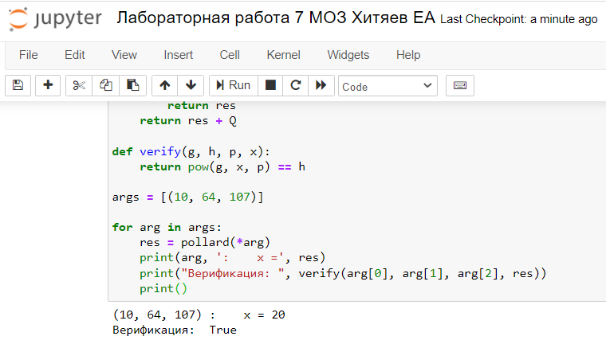

---
# Front matter
title: "Отчёт по лабораторной работе №7"
subtitle: "Дискретное логарифмирование в конечном поле"
author: "Хитяев Евгений Анатольевич НПМмд-02-21"

# Generic otions
lang: ru-RU
toc-title: "Содержание"

# Pdf output format
toc: true # Table of contents
toc_depth: 2
lof: true # List of figures
fontsize: 12pt
linestretch: 1.5
papersize: a4
documentclass: scrreprt
## I18n
polyglossia-lang:
  name: russian
  options:
	- spelling=modern
	- babelshorthands=true
polyglossia-otherlangs:
  name: english
### Fonts
mainfont: PT Serif
romanfont: PT Serif
sansfont: PT Sans
monofont: PT Mono
mainfontoptions: Ligatures=TeX
romanfontoptions: Ligatures=TeX
sansfontoptions: Ligatures=TeX,Scale=MatchLowercase
monofontoptions: Scale=MatchLowercase,Scale=0.9
## Biblatex
biblatex: true
biblio-style: "gost-numeric"
biblatexoptions:
  - parentracker=true
  - backend=biber
  - hyperref=auto
  - language=auto
  - autolang=other*
  - citestyle=gost-numeric
## Misc options
indent: true
header-includes:
  - \linepenalty=10 # the penalty added to the badness of each line within a paragraph (no associated penalty node) Increasing the value makes tex try to have fewer lines in the paragraph.
  - \interlinepenalty=0 # value of the penalty (node) added after each line of a paragraph.
  - \hyphenpenalty=50 # the penalty for line breaking at an automatically inserted hyphen
  - \exhyphenpenalty=50 # the penalty for line breaking at an explicit hyphen
  - \binoppenalty=700 # the penalty for breaking a line at a binary operator
  - \relpenalty=500 # the penalty for breaking a line at a relation
  - \clubpenalty=150 # extra penalty for breaking after first line of a paragraph
  - \widowpenalty=150 # extra penalty for breaking before last line of a paragraph
  - \displaywidowpenalty=50 # extra penalty for breaking before last line before a display math
  - \brokenpenalty=100 # extra penalty for page breaking after a hyphenated line
  - \predisplaypenalty=10000 # penalty for breaking before a display
  - \postdisplaypenalty=0 # penalty for breaking after a display
  - \floatingpenalty = 20000 # penalty for splitting an insertion (can only be split footnote in standard LaTeX)
  - \raggedbottom # or \flushbottom
  - \usepackage{float} # keep figures where there are in the text
  - \floatplacement{figure}{H} # keep figures where there are in the text
---

# Цель работы

Изучение задачи дискретного логарифмирования.

# Теоретические сведения

Пусть в некоторой конечной мультипликативной абелевой группе $G$ задано уравнение

$$g^x=a$$

Решение задачи дискретного логарифмирования состоит в нахождении некоторого целого неотрицательного числа $x$, удовлетворяющего уравнению. Если оно разрешимо, у него должно быть хотя бы одно натуральное решение, не превышающее порядок группы.
Это сразу даёт грубую оценку сложности алгоритма поиска решений сверху — алгоритм полного перебора нашёл бы решение за число шагов не выше порядка данной группы.

Чаще всего рассматривается случай, когда группа является циклической, порождённой элементом $g$.
В этом случае уравнение всегда имеет решение. 
В случае же произвольной группы вопрос о разрешимости задачи дискретного логарифмирования, то есть вопрос о существовании решений уравнения , требует отдельного рассмотрения.

## p-алгоритм Полларда

* Вход. Простое число $p$, число $a$ порядка $r$ по модулю $p$, целое число $b$б $1 < b < p$; отображение $f$, обладающее сжимающими свойствами и сохраняющее вычислимость логарифма.
* Выход. показатель $x$, для которого $a^x=b(mod p)$, если такой показатель существует.

1. Выбрать произвольные целые числа $u, v$ и положить $c=a^u b^v (mod p), d=c$
2. Выполнять $c=f(c)(mod p), d=f(f(d))(mod p), вычисляя при этом логарифмы для $c$ и $d$ как линейные функции от $x$ по модулю $r$, до получения равенства $c=d (mod p)$
3. Приняв логарифмы для $c$ и $d$, вычислить логарифм $x$ решением сравнения по модулю $r$. Результат $x$ или "Решения нет".

# Выполнение работы

## Реализация алгоритмов на языке Python

```
from math import gcd

ag = 1
bg = 1

def f(x, n):
    return (x*x+5)%n

def method(n, a, b, d):
    a = f(a, n)%n
    b = f(f(b,n), n)%n
    d = gcd(a-b, n)
    if 1 < d < n:
        p = d
        print(p)
        exit()
    if d == n:
        print("Делитель не найден")
    if d == 1:
        global ag
        ag = b
        method(n, a, b, d)

def main():
    n = 1359331
    c = 1
    a = c
    b = c
    a = f(a, n)%n
    b = f(a, n)%n
    d = gcd(a-b, n)
    if 1 < d < n:
        p = d
        print(p)
        exit()
    if d == n:
        pass
    if d == 1:
        method(n, a, b, d)

main()
```

## Контрольный пример

{ #fig:001 width=70% height=70%}

Таким образом, число 1181 является нетривиальным делителем числа 1359331.

# Выводы

В ходе выполнения работы мне удалось изучить задачу разложения на множители и p-алгоритм Полларда, а также реализовать данный алгоритм программно на языке Python.


# Список литературы{.unnumbered}

1. [Алгоритмы тестирования на простоту и факторизации](https://habr.com/ru/post/521876/)
2. [P-метод Полларда](https://ru.bmstu.wiki/P-метод_Полларда)