---
# Front matter
lang: ru-RU
title: "Лабораторная работа 2. Markdown"
subtitle: "Отчет по лабораторной работе 2"
author: "Хитяев Евгений Анатольевич НПМмд-02-21"

# Formatting
toc-title: "Содержание"
toc: true # Table of contents
toc_depth: 2
lof: true # List of figures
fontsize: 12pt
linestretch: 1.5
papersize: a4paper
documentclass: scrreprt
polyglossia-lang: russian
polyglossia-otherlangs: english
mainfont: PT Serif
romanfont: PT Serif
sansfont: PT Sans
monofont: PT Mono
mainfontoptions: Ligatures=TeX
romanfontoptions: Ligatures=TeX
sansfontoptions: Ligatures=TeX,Scale=MatchLowercase
monofontoptions: Scale=MatchLowercase
indent: true
pdf-engine: lualatex
header-includes:
  - \linepenalty=10 # the penalty added to the badness of each line within a paragraph (no associated penalty node) Increasing the value makes tex try to have fewer lines in the paragraph.
  - \interlinepenalty=0 # value of the penalty (node) added after each line of a paragraph.
  - \hyphenpenalty=50 # the penalty for line breaking at an automatically inserted hyphen
  - \exhyphenpenalty=50 # the penalty for line breaking at an explicit hyphen
  - \binoppenalty=700 # the penalty for breaking a line at a binary operator
  - \relpenalty=500 # the penalty for breaking a line at a relation
  - \clubpenalty=150 # extra penalty for breaking after first line of a paragraph
  - \widowpenalty=150 # extra penalty for breaking before last line of a paragraph
  - \displaywidowpenalty=50 # extra penalty for breaking before last line before a display math
  - \brokenpenalty=100 # extra penalty for page breaking after a hyphenated line
  - \predisplaypenalty=10000 # penalty for breaking before a display
  - \postdisplaypenalty=0 # penalty for breaking after a display
  - \floatingpenalty = 20000 # penalty for splitting an insertion (can only be split footnote in standard LaTeX)
  - \raggedbottom # or \flushbottom
  - \usepackage{float} # keep figures where there are in the text
  - \floatplacement{figure}{H} # keep figures where there are in the text
---

# Цель работы

Научиться оформлять отчёты с помощью легковесного языка разметки Markdown.

# Теоретические сведения

Вся теоритическая часть по использованию языка разметки Markdown была взята из инструкции по лабораторной работе №2 на сайте:
https://esystem.rudn.ru/pluginfile.php/1284122/mod_resource/content/3/002-markdown.pdf 

# Задание

– Сделайте отчёт по предыдущей лабораторной работе в формате Markdown.
– В качестве отчёта просьба предоставить отчёты в 3 форматах: pdf, docx и md (в архиве,
поскольку он должен содержать скриншоты, Makefile и т.д.)

# Выполнение лабораторной работы

**1.**	Создадим учётную запись на https://github.com (см. рис. 1)

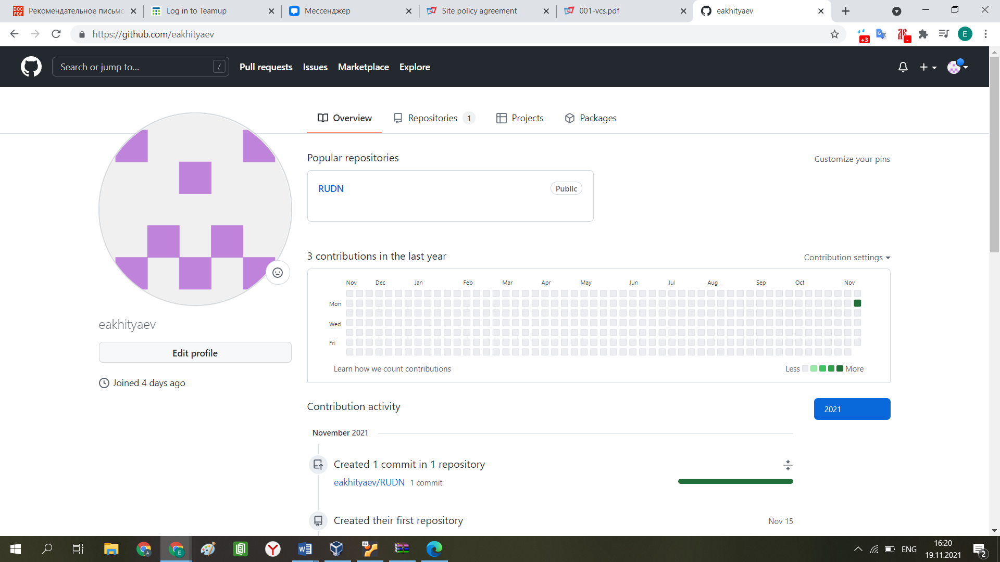{ #fig:001 width=70% }

**2.**	Установим git на наш компьютер (алгоритм представлен на рис. 2).

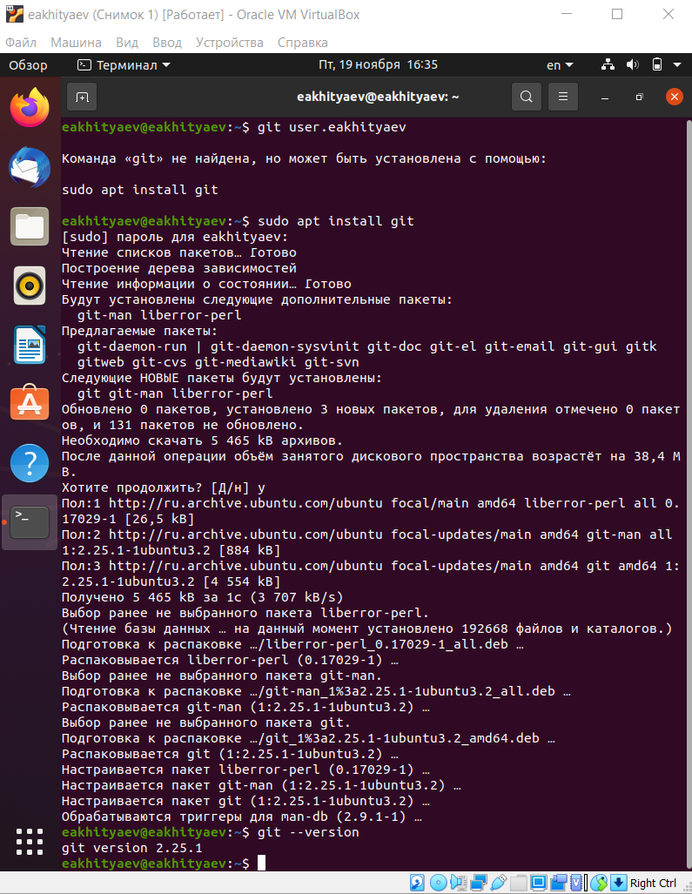{ #fig:002 width=70% }

**3.**	Настроим систему контроля версий git, как это указано в инструкции к 1-ой лаборатной работе c использованием сервера репозиториев https://github.com/.
Для этого необходимо сгенерировать пару ключей (приватный и открытый), а затем вставить их в SSH-ключи на github (см. рис. 3, 4, 5).

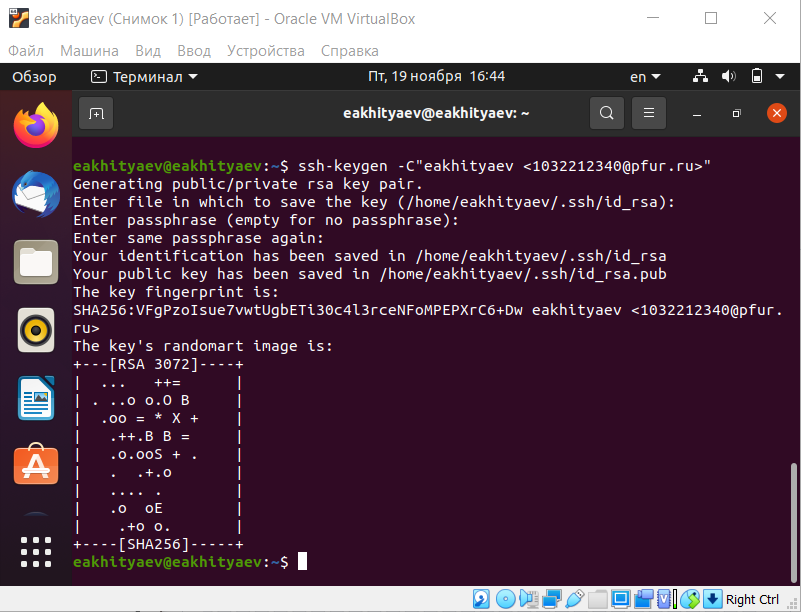{ #fig:003 width=70% }
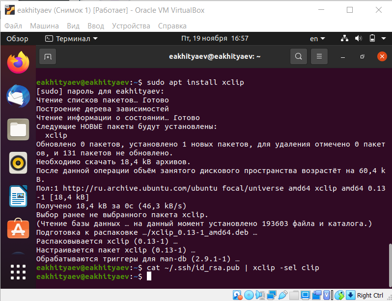{ #fig:004 width=70% }
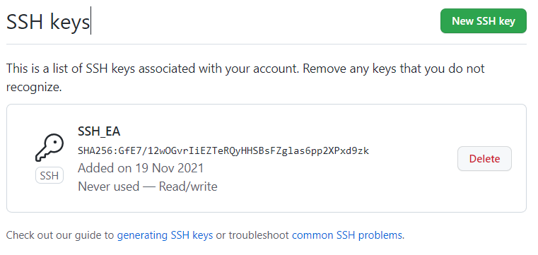{ #fig:005 width=70% }

**4.**	Следующим шагом будет создание и подключение репозитория к GitHub. В GitHub заходим в «repository» и создаём новый репозиторий (имя «laboratory», а заголовок для файла README) (см. рис. 6, 7). Копируем в консоль ссылку на репозиторий (для дальнейшей работы с файлами):

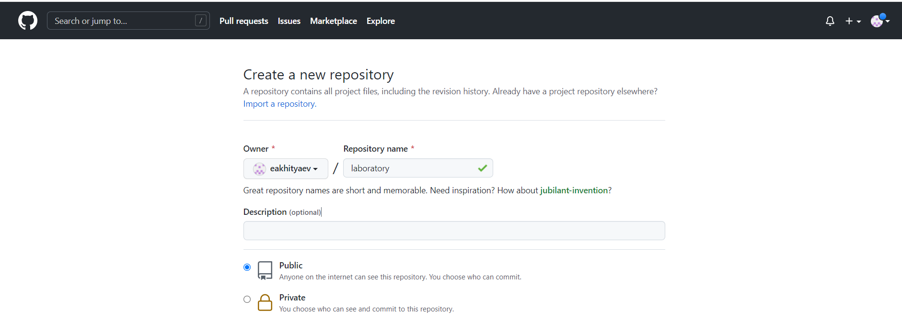{ #fig:006 width=70% }
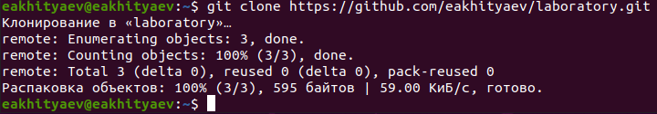{ #fig:007 width=70% }

Рабочий каталог будем обозначать как laboratory. Вначале нужно перейти в этот каталог (рис. 8):
–cd laboratory

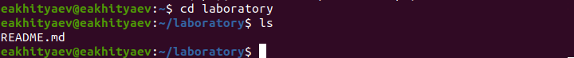{ #fig:008 width=70% }

После этого можем создавать наши файлы.
Инициализируем системы git:
–git init
Создаём заготовку для файла README.md:
–echo "# Лабораторные работы" >> README.md
–git add README.md
Делаем первый коммит и выкладываем на github:
–git commit -m "first commit"
–git remote add origin git@github.com:/sciproc-intro.git
–git push -u origin master
Результат проделанных операций представлен ниже (рис. 9, 10, 11, 12).

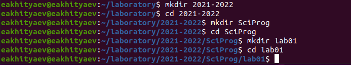{ #fig:009 width=70% }
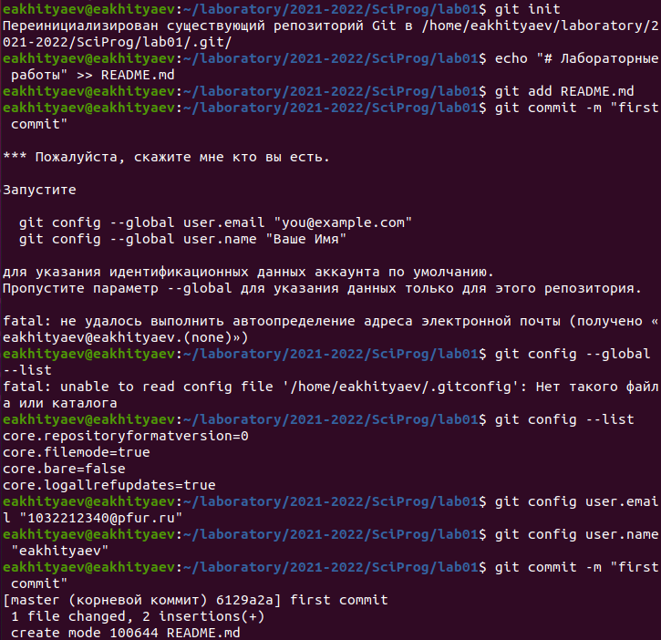{ #fig:010 width=70% }
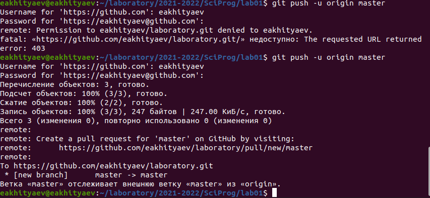{ #fig:011 width=70% }
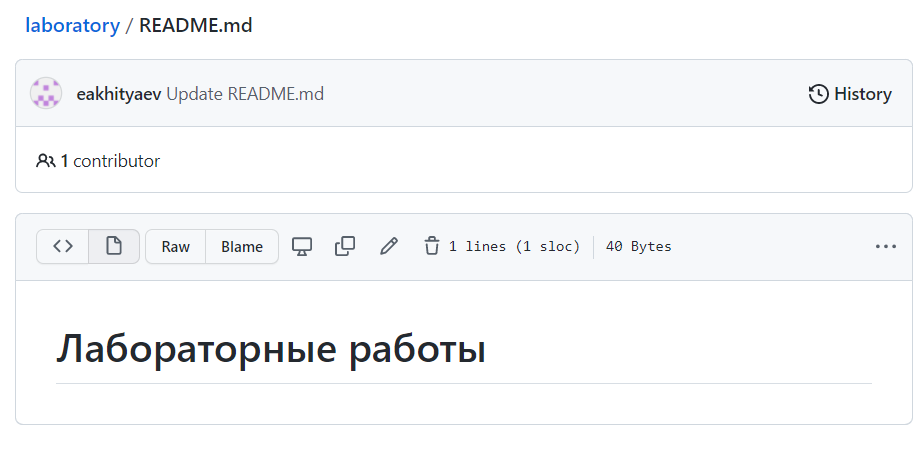{ #fig:012 width=70% }

**5.**	Первичная конфигурация
Добавим файл лицензии:
–wget https://creativecommons.org/licenses/by/4.0/legalcode.txt -O
Добавим шаблон игнорируемых файлов. Просмотрим список имеющихся шаблонов:
–curl -L -s https://www.gitignore.io/api/list
Затем скачаем шаблон, например, для C:
–curl -L -s https://www.gitignore.io/api/c >> .gitignore
Можно это же сделать через web-интерфейс на сайте https://www.gitignore.io/.
Добавим новые файлы:
–git add .
Выполним коммит:
–git commit -a
Отправим на github:
–git push
Результат проделанных операций представлен ниже (рис. 13, 14, 15, 16, 17).

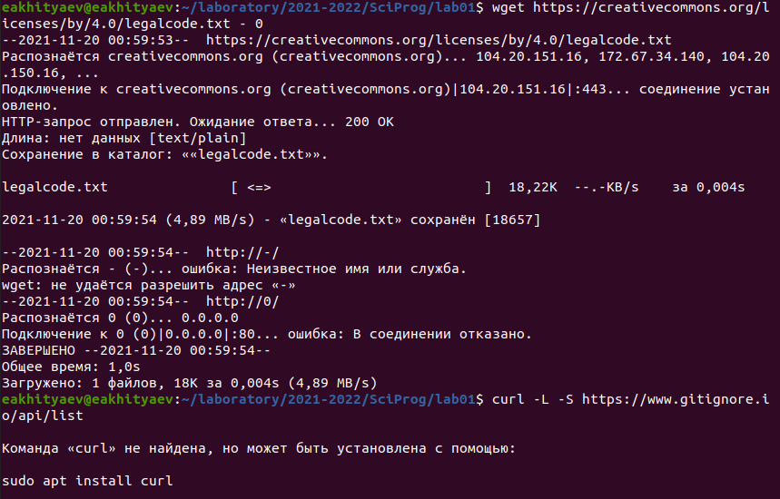{ #fig:013 width=70% }
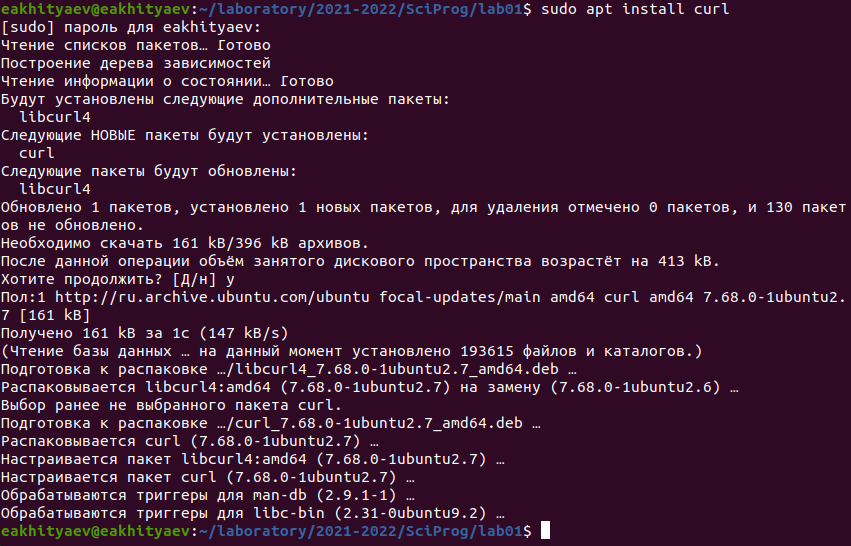{ #fig:014 width=70% }
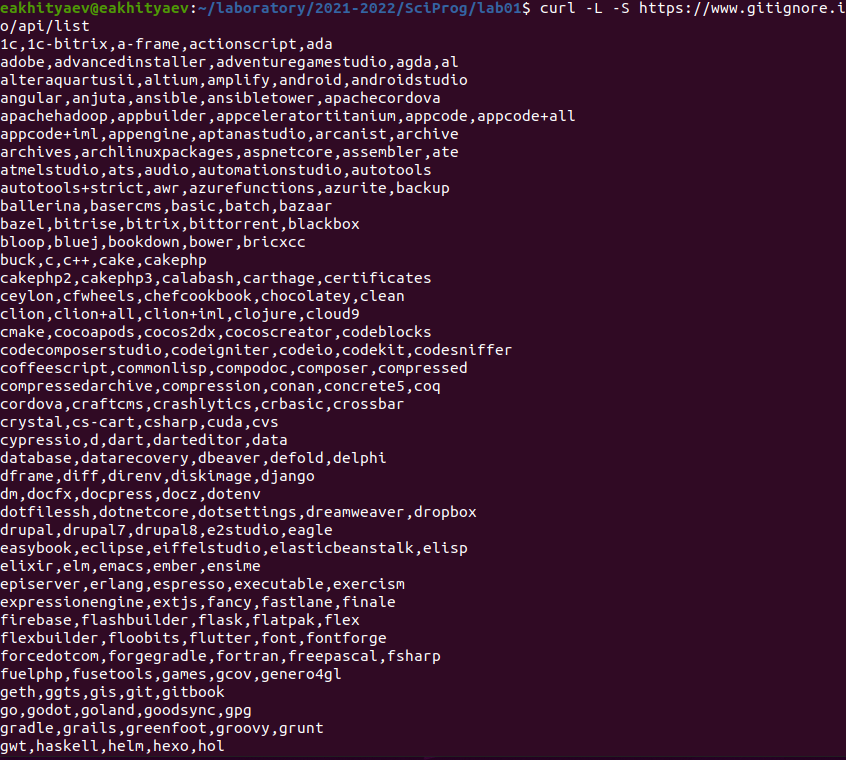{ #fig:015 width=70% }
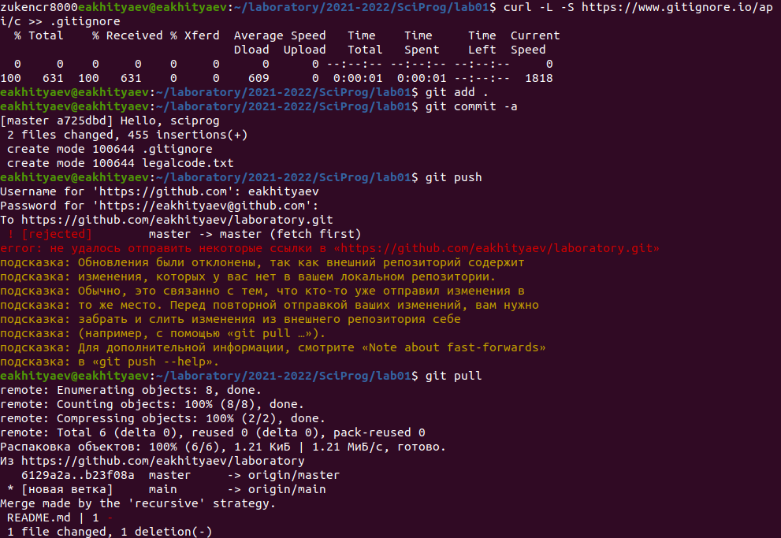{ #fig:016 width=70% }
{ #fig:017 width=70% }

**6.**	Работа с конфигурацией git-flow.
Инициализируем git-flow (рис. 18):
git flow init
Префикс для ярлыков установим в v.

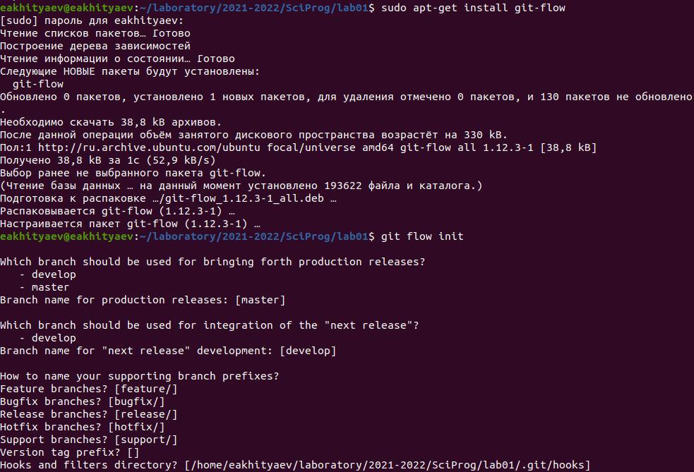{ #fig:018 width=70% }

Проверим, что Вы на ветке develop (рис. 19):
git branch

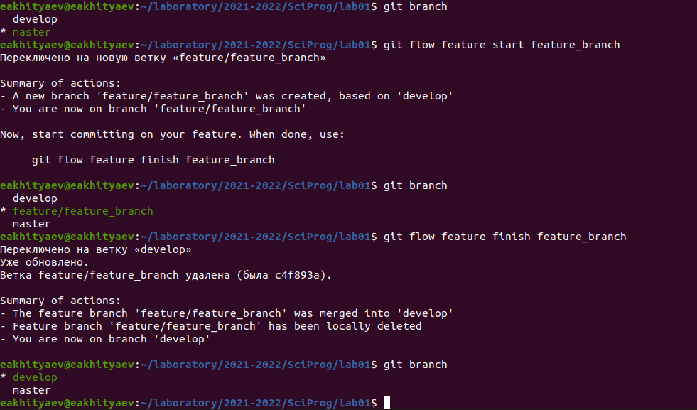{ #fig:019 width=70% }

Создадим релиз с версией 1.0.0 (рис. 20):
git flow release start 1.0.0
Запишем версию:
echo "1.0.0" >> VERSION
Добавим в индекс:
git add .
git commit -am 'chore(main): add version'

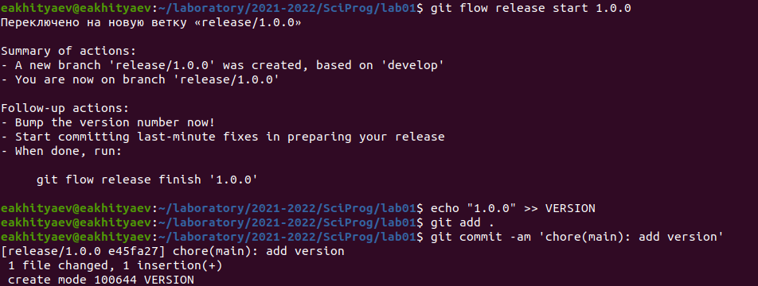{ #fig:020 width=70% }

Зальём релизную ветку в основную ветку (рис. 21):
git flow release finish 1.0.0
Отправим данные на github:
git push --all
git push --tags

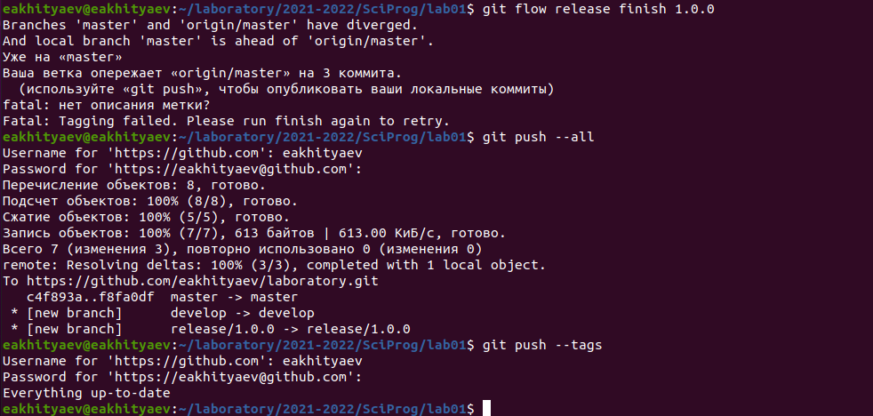{ #fig:021 width=70% }

**7.**	 Создадим релиз на github. Для этого заходим в «Releases», нажимаем «Создать новый релиз». Заходим в теги и заполняем все поля (создаём теги для версии 1.0.0) (рис. 22). После создания тега, автоматически сформируется релиз (рис. 23).

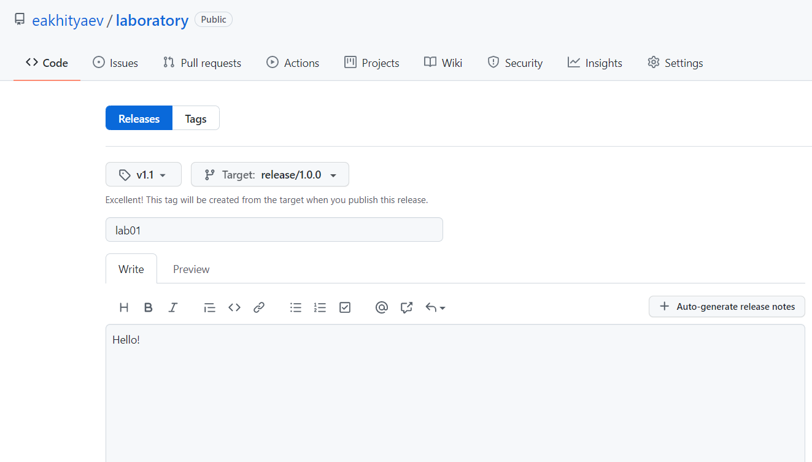{ #fig:022 width=70% }
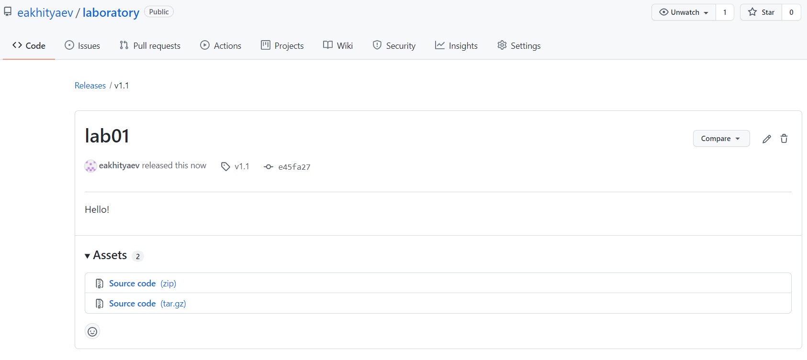{ #fig:023 width=70% }

# Выводы

Изучил идеологию и научился применять средства контроля версий.

# Контрольные вопросы

1) Что такое системы контроля версий (VCS) и для решения каких задач они предназначаются?

• Системы контроля версий (Version Control System, VCS) применяются при работе
нескольких человек над одним проектом.

2) Объясните следующие понятия VCS и их отношения: хранилище, commit, история, рабочая копия.

• Хранилище (repository), или репозитарий, —место хранения всех версий и служебной информации. Commit («[трудовой] вклад», не переводится) — синоним версии; процесс создания новой версии. Рабочая копия (working copy) — текущее состояние файлов проекта, основанное на версии, загруженной из хранилища (обычно на последней).

3) Что представляют собой и чем отличаются централизованные и децентрализованные VCS? Приведите примеры VCS каждого вида.

• Централизованные системы контроля версий представляют собой приложения типа клиент-сервер, когда репозиторий проекта существует в единственном экземпляре и хранится на сервере. Доступ к нему осуществлялся через специальное клиентское приложение. В качестве примеров таких программных продуктов можно привести CVS, Subversion. распределенные системы контроля версий (Distributed Version Control System, DVCS) позволяют хранить репозиторий (его копию) у каждого разработчика, работающего с данной системой. При этом можно выделить центральный репозиторий (условно), в который будут отправляться изменения из локальных и, с ним же эти локальные репозитории будут синхронизироваться. При работе с такой системой, пользователи периодически синхронизируют свои локальные репозитории с центральным и работают непосредственно со своей локальной копией. После внесения достаточного количества изменений в локальную копию они (изменения) отправляются на сервер. При этом сервер, чаще всего, выбирается условно, т. к. в большинстве DVCS нет такого понятия как “выделенный сервер с центральным репозиторием”. Еще пример - Wikipedia.

• В децентрализованных системах каждый узел принимает свое собственное решение. Конечное поведение системы является совокупностью решений отдельных узлов. Пример — Bitcoin.

• В классических системах контроля версий используется централизованная модель, предполагающая наличие единого репозитория для хранения файлов. Выполнение большинства функций по управлению версиями осуществляется специальным сервером.

4) Опишите действия с VCS при единоличной работе с хранилищем.

• Создадим локальный репозиторий. Сначала сделаем предварительную конфигурацию, указав имя и email владельца репозитория:

   git config --global user.name "Имя Фамилия"

   git config --global user.email "work@mail"

   и настроив utf-8 в выводе сообщений git:

   git config --global quotepath false

   Для инициализации локального репозитория, расположенного, например, в каталоге ~/tutorial, необходимо ввести в командной строке:

   cd

   mkdir tutorial

   cd tutorial

   git init

5) Опишите порядок работы с общим хранилищем VCS.

• Для последующей идентификации пользователя на сервере репозиториев необходимо сгенерировать пару ключей (приватный и открытый):

   ssh-keygen -C "Имя Фамилия <work@mail>"

   Ключи сохраняться в каталоге~/.ssh/.

   Скопировав из локальной консоли ключ в буфер обмена

   cat ~/.ssh/id_rsa.pub | xclip -sel clip

   вставляем ключ в появившееся на сайте поле.

6) Каковы основные задачи, решаемые инструментальным средством git?

• У Git две основных задачи: первая — хранить информацию о всех изменениях в вашем коде, начиная с самой первой строчки, а вторая — обеспечение удобства командной работы над кодом.

7) Назовите и дайте краткую характеристику командам git.

• Наиболее часто используемые команды git:

– создание основного дерева репозитория:

git init

– получение обновлений (изменений) текущего дерева из центрального репозитория:
git pull

– отправка всех произведённых изменений локального дерева в центральный репозиторий:

git push
– просмотр списка изменённых файлов в текущей директории:
git status

– просмотр текущих изменения:

git diff

– добавить все изменённые и/или созданные файлы и/или каталоги:
git add .

– добавить конкретные изменённые и/или созданные файлы и/или каталоги:

git add имена_файлов
– удалить файл и/или каталог из индекса репозитория (при этом файл и/или каталог
остаётся в локальной директории):

git rm имена_файлов

– сохранение добавленных изменений:

– сохранить все добавленные изменения и все изменённые файлы:
git commit -am 'Описание коммита'

– сохранить добавленные изменения с внесением комментария через встроенный
редактор:

git commit

– создание новой ветки, базирующейся на текущей:
git checkout -b имя_ветки

– переключение на некоторую ветку:

git checkout имя_ветки

– отправка изменений конкретной ветки в центральный репозиторий:

git push origin имя_ветки

– слияние ветки с текущим деревом:

git merge --no-ff имя_ветки

8) Приведите примеры использования при работе с локальным и удалённым репозиториями.

• Использования git при работе с локальными репозиториями (добавления текстового документа в локальный репозиторий):

git add hello.txt

git commit -am 'Новый файл'

9) Что такое и зачем могут быть нужны ветви (branches)?

• Ветки нужны для того, чтобы программисты могли вести совместную работу над проектом и не мешать друг другу при этом. Кроме того, с помощью branches решаются следующие проблемы: нужно постоянно создавать архивы с рабочим кодом, сложно "переключаться" между архивами, сложно перетаскивать изменения между архивами, легко что-то напутать или потерять.

10) Как и зачем можно игнорировать некоторые файлы при commit?

• Игнорируемые файлы — это, как правило, артефакты сборки и файлы, генерируемые машиной из исходных файлов в вашем репозитории. Во время работы над проектом эти файлы могут создаваться, но их не требуется добавлять в последствии в репозиторий. Например, временные файлы, создаваемые редакторами, или объектные файлы, создаваемые компиляторами. Можно прописать шаблоны игнорируемых при добавлении в репозиторий типов файлов в файл.gitignore с помощью сервисов. Для этого сначала нужно получить список имеющихся шаблонов:

curl -L -s https://www.gitignore.io/api/list

Затем скачать шаблон, например, для C и C++:

curl -L -s https://www.gitignore.io/api/c >> .gitignore

curl -L -s https://www.gitignore.io/api/c++ >> .gitignore
