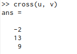

---
## Front matter
lang: ru-RU
title: Презентация по лабораторной работе №3
author: Хитяев Евгений Анатольевич, НПМмд-02-21
institute: РУДН, Москва, Россия

date: 26 ноября 2021

## Formatting
mainfont: PT Serif
romanfont: PT Serif
sansfont: PT Sans
monofont: PT Mono
toc: false
slide_level: 2
theme: metropolis
header-includes: 
 - \metroset{progressbar=frametitle,sectionpage=progressbar,numbering=fraction}
 - '\makeatletter'
 - '\beamer@ignorenonframefalse'
 - '\makeatother'
aspectratio: 43
section-titles: true
---

# Лабораторная работа №3. Введение в работу с Octave.

## Простейшие операции

- На скриншоте продемонстрировано, как Octave можно использовать в качестве простейшего калькулятора.

{ #fig:001 width=25% }

- Также можно выполнять и другие операции, например, задать матрицу (как на скриншоте ниже).

{ #fig:002 width=30% }

## Операции с векторами

- Если задать два вектора, то в Octave можно производить, например, операцию сложения векторов (первый скриншот) или производить векторное умножение (второй скриншот).

{ #fig:003 width=20% }

{ #fig:004 width=20% }

## Вычисление проектора

- Также, если задать, например, два вектора-строки, то можно вычислить проекцию одного вектора на другой (пример представлен на скриншоте).

{ #fig:005 width=70% }

## Матричные операции

- В Octave можно осуществлять матричные операции, например, находить произведение матриц (figure 6), обратную матрицу (figure 7).

{ #fig:006 width=30% }

{ #fig:007 width=30% }

## Матричные операции
- Можно также найти и определитель матрицы (figure 8).

{ #fig:008 width=30% }

## Построение графиков

- В Octave можно, например, построить график функции sin(x) на интервале [0, 2π], выделять его красным цветом, добавлять сетку, подпись и легенду (пример представлен на скриншоте).

{ #fig:009 width=40% } 

## Построение графиков

- Кроме того, на одном чертеже можно строить большее число графиков, например, два (пример представлен на скриншоте).

{ #fig:010 width=40% }

## График y=x^2^sin(x)

- Можно построить и более сложный график уже с использованием поэлементного возведения в степень и поэлементного умножения (график представлен на скриншоте ниже)

{ #fig:011 width=40% }

## Сравнение циклов и операций с векторами

- Сравним эффективность работы с циклами и операций с векторами. Для этого вычислим следующую сумму 3.1 с помощью цикла (figure 13) и с помощью операций с векторами (figure 14).

{ #fig:012 width=60% }

## Сравнение циклов и операций с векторами

{ #fig:013 width=50% }

{ #fig:014 width=50% }

Во втором случае сумма вычисляется значительно быстрее.

## Выводы

- В ходе выполнения работы я познакомился с некоторыми простейшими операциями в Octave.

