---
# Front matter
lang: ru-RU
title: "Лабораторная работа 3. Введение в работу с Octave"
subtitle: "Отчет по лабораторной работе 3"
author: "Хитяев Евгений Анатольевич НПМмд-02-21"

# Formatting
toc-title: "Содержание"
toc: true # Table of contents
toc_depth: 2
lof: true # List of figures
fontsize: 12pt
linestretch: 1.5
papersize: a4paper
documentclass: scrreprt
polyglossia-lang: russian
polyglossia-otherlangs: english
mainfont: PT Serif
romanfont: PT Serif
sansfont: PT Sans
monofont: PT Mono
mainfontoptions: Ligatures=TeX
romanfontoptions: Ligatures=TeX
sansfontoptions: Ligatures=TeX,Scale=MatchLowercase
monofontoptions: Scale=MatchLowercase
indent: true
pdf-engine: lualatex
header-includes:
  - \linepenalty=10 # the penalty added to the badness of each line within a paragraph (no associated penalty node) Increasing the value makes tex try to have fewer lines in the paragraph.
  - \interlinepenalty=0 # value of the penalty (node) added after each line of a paragraph.
  - \hyphenpenalty=50 # the penalty for line breaking at an automatically inserted hyphen
  - \exhyphenpenalty=50 # the penalty for line breaking at an explicit hyphen
  - \binoppenalty=700 # the penalty for breaking a line at a binary operator
  - \relpenalty=500 # the penalty for breaking a line at a relation
  - \clubpenalty=150 # extra penalty for breaking after first line of a paragraph
  - \widowpenalty=150 # extra penalty for breaking before last line of a paragraph
  - \displaywidowpenalty=50 # extra penalty for breaking before last line before a display math
  - \brokenpenalty=100 # extra penalty for page breaking after a hyphenated line
  - \predisplaypenalty=10000 # penalty for breaking before a display
  - \postdisplaypenalty=0 # penalty for breaking after a display
  - \floatingpenalty = 20000 # penalty for splitting an insertion (can only be split footnote in standard LaTeX)
  - \raggedbottom # or \flushbottom
  - \usepackage{float} # keep figures where there are in the text
  - \floatplacement{figure}{H} # keep figures where there are in the text
---

# Цель работы

Познакомиться с интерфейсом Octave.

# Теоретические сведения

Octave является свободной реализацией языка MATLAB. Графический интерфейс Octave похож на графический интерфейс MATLAB.
Язык MATLAB был разработан Кливом Моулером (англ. Cleve Moler) в конце 1970-х годов. Целью разработки служила задача дать студентам факультета возможность использования программных библиотек Linpack и EISPACK без необходимости изучения языка FORTRAN. Язык распространился среди других университетов и был с большим интересом встречен учёными, работающими в области прикладной математики. MATLAB широко используется для выполнения инженерных и научных расчётов, а также в образовании. В 1984 году была основана компания The MathWorks для коммерциализации MATLAB.

Вся теоритическая часть по использованию интерфейса Octave была взята из инструкции по лабораторной работе №3 на сайте:
https://esystem.rudn.ru/pluginfile.php/1284124/mod_resource/content/4/003-octave-intro.pdf

# Задание

Выполните работу и задокументируйте процесс выполнения.

# Выполнение лабораторной работы

**1. Простейшие операции**

- Включим журналирование сессии (см. рис. 1).

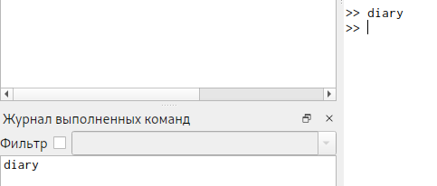{ #fig:001 width=70% }

- Продемонстрируем, что Octave можно использовать как простейший калькулятор. Для этого вычислим выражение (см. рис. 2).

{ #fig:002 width=70% }

- Зададим вектор-строку (ковектор) (см. рис. 3).

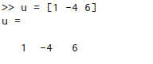{ #fig:003 width=70% }

- Зададим вектор-столбец (вектор) (см. рис. 4).

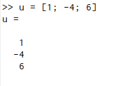{ #fig:004 width=70% }

- Зададим матрицу (см. рис. 5).

{ #fig:005 width=70% }

**2. Операции с векторами**

- Зададим два вектора-столбца (см. рис. 6).

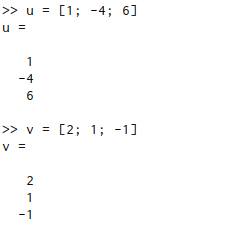{ #fig:006 width=70% }

- Выполним операцию сложения векторов (см. рис. 7).

{ #fig:007 width=70% }

- Произведем скалярное умножение векторов (см. рис. 8).

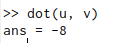{ #fig:008 width=70% }

- Произведем векторное умножение (см. рис. 9).

{ #fig:009 width=70% }

- Вычислим норму вектора (см. рис. 10).

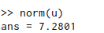{ #fig:010 width=70% }

**3. Вычисление проектора**

- Введем два вектора-строки (см. рис. 11).

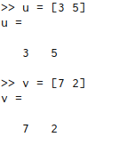{ #fig:011 width=70% }

- Вычислим проекцию вектора u на вектор v (см. рис. 12).

{ #fig:012 width=70% }

**4. Матричные операции**

- Введем матрицы Â и B (см. рис. 13).

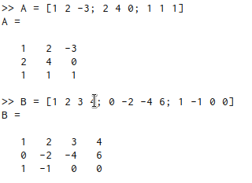{ #fig:013 width=70% }

- Вычислим произведение матриц ÂB (см. рис. 14).

{ #fig:014 width=70% }

- Вычислим произведение матриц B̂^T^Â.(см. рис. 15).

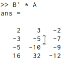{ #fig:015 width=70% }

- Вычислим 2Â - 4Î, где Î есть единичная матрица (см. рис. 16).

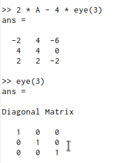{ #fig:016 width=70% }

- Найдем определитель |Â| (см. рис. 17).

{ #fig:017 width=70% }

- Найдем обратную матрицу Â^−1^ (см. рис. 18).

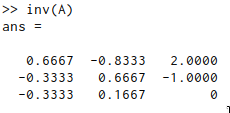{ #fig:018 width=70% }

- Найдем собственные значения матрицы (см. рис. 19).

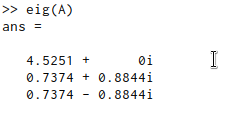{ #fig:019 width=70% }

- Вычислим ранг матрицы (см. рис. 20).

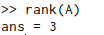{ #fig:020 width=70% }

**5. Построение простейших графиков**

- Построим график функции sin(x) на интервале [0, 2π]. Создадим вектор значений x (см. рис. 21).

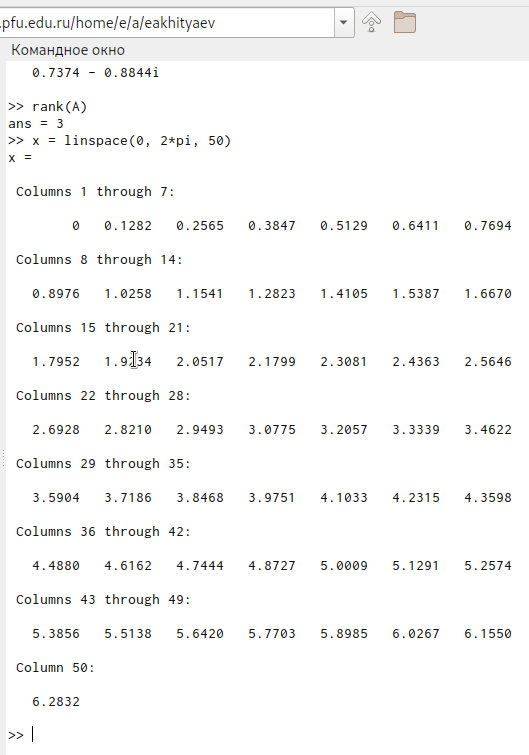{ #fig:021 width=70% }

- Зададим вектор y = sin(x) (см. рис. 22).

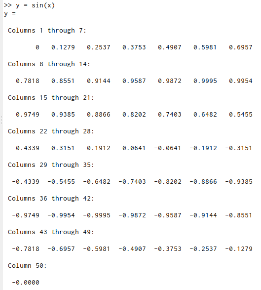{ #fig:022 width=70% }

- Построим график (см. рис. 23.1, 23.2).

{ #fig:023.1 width=70% }

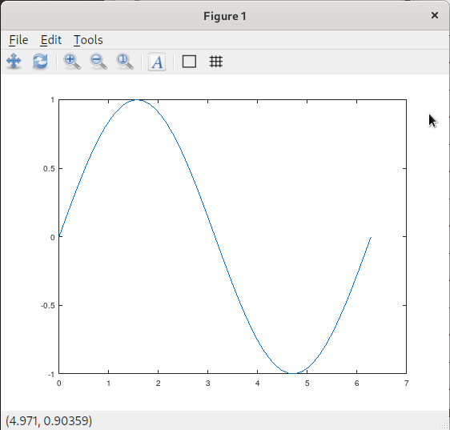{ #fig:023.2 width=70% }

- Улучшим внешний вид графика. Сначала очистим получившийся график (см. рис. 24.1). Заметим, что заданные вектора x и y сохранились (см. рис. 24.2).

{ #fig:024.1 width=70% }

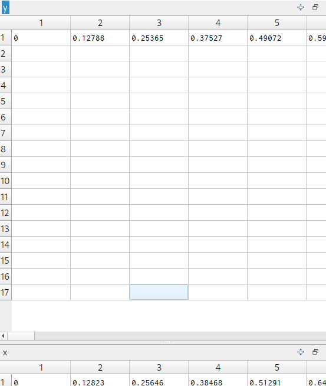{ #fig:024.2 width=70% }

- Зададим красный цвет для линии и сделаем ее потолще (см. рис. 25.1, 25.2).

{ #fig:025.1 width=70% }

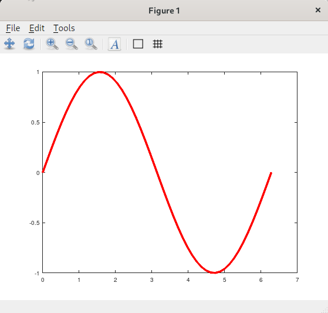{ #fig:025.2 width=70% }

- Подгоним диапазон осей (см. рис. 26.1, 26.2).

{ #fig:026.1 width=70% }

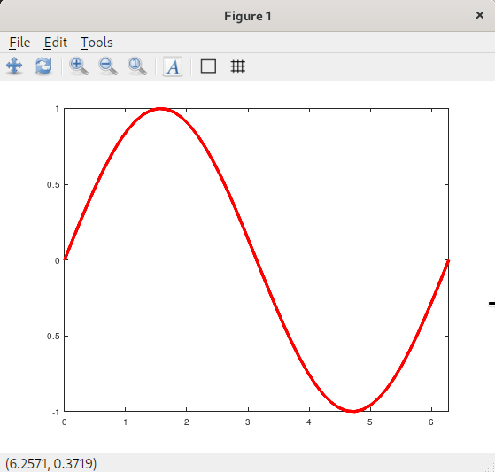{ #fig:026.2 width=70% }

- Нарисуем сетку (см. рис. 27.1, 27.2).

{ #fig:027.1 width=70% }

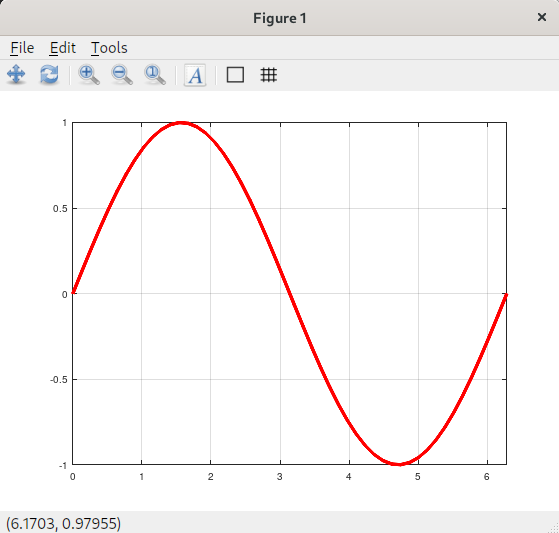{ #fig:027.2 width=70% }

- Подпишем оси (см. рис. 28.1, 28.2).

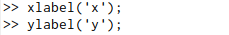{ #fig:028.1 width=70% }

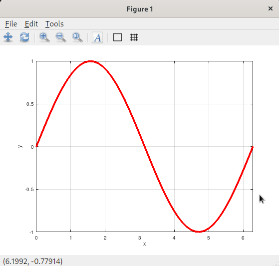{ #fig:028.2 width=70% }

- Сделаем заголовок графика и зададим легенду (см. рис. 29). В результате получим следующий график (см. рис. 30).

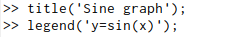{ #fig:029 width=70% }

{ #fig:030 width=70% }

**6. Два графика на одном чертеже**

- Начертим два графика на одном чертеже. Очистим память и рабочую область фигуры (см. рис. 31).

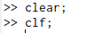{ #fig:031 width=70% }

- Зададим два вектора (см. рис. 32).

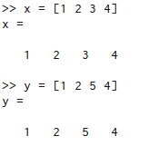{ #fig:032 width=70% }

- Начертим эти точки, используя кружочки, как маркеры (см. рис. 33, 34).

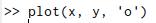{ #fig:033 width=70% }

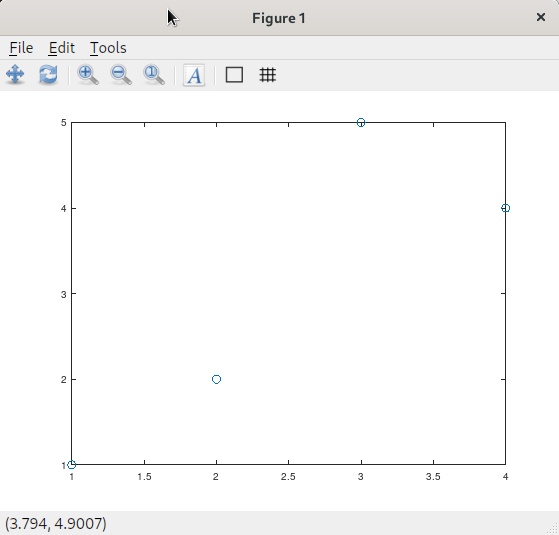{ #fig:034 width=70% }

- Чтобы добавить к нашему текущему графику ещё один, нужно использовать команду hold on (см. рис. 35).

{ #fig:035 width=70% }

- Добавим график регрессии (см. рис. 36, 37).

{ #fig:036 width=70% }

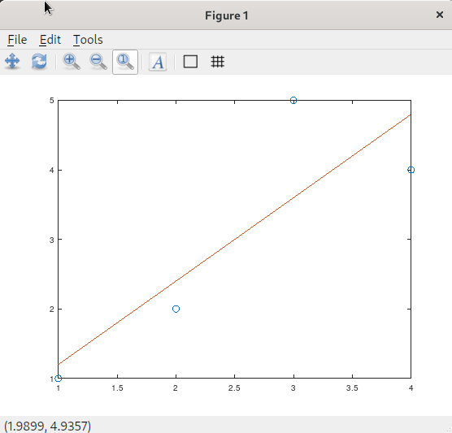{ #fig:037 width=70% }

- Зададим сетку, оси и легенду (см. рис. 38). В результате получим следующий график (см. рис. 39).

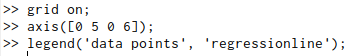{ #fig:038 width=70% }

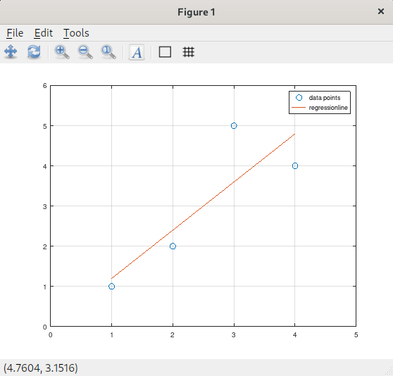{ #fig:039 width=70% }

**7. График y=x^2^sin(x)**

- Очистим память и рабочую область фигуры (см. рис. 40, 41).

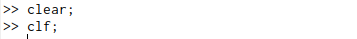{ #fig:040 width=70% }

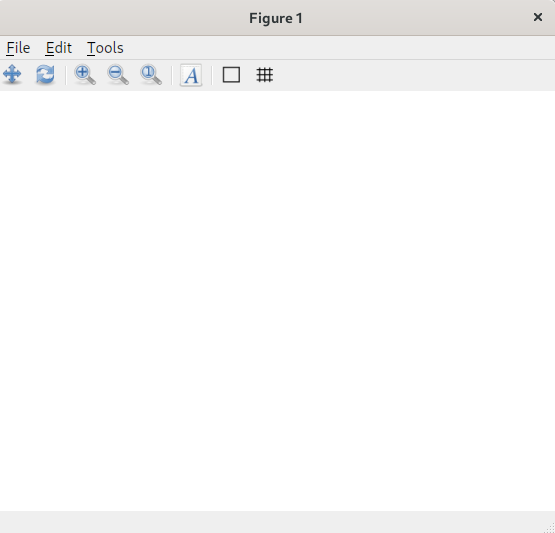{ #fig:041 width=70% }

- Зададим вектор x (см. рис. 42).

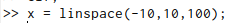{ #fig:042 width=70% }

- Построим график y=x^2^sin(x) (см. рис. 43).

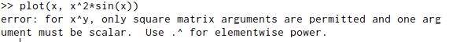{ #fig:043 width=70% }

Ничего не получилось. Действительно, мы задали в выражении матричное умножение. В то время, как нам необходимо поэлементное.

- Построим график y=x^2^sin(x), используя поэлементное возведение в степень .^ и поэлементное умножение (см. рис. 44, 45).

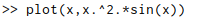{ #fig:044 width=70% }

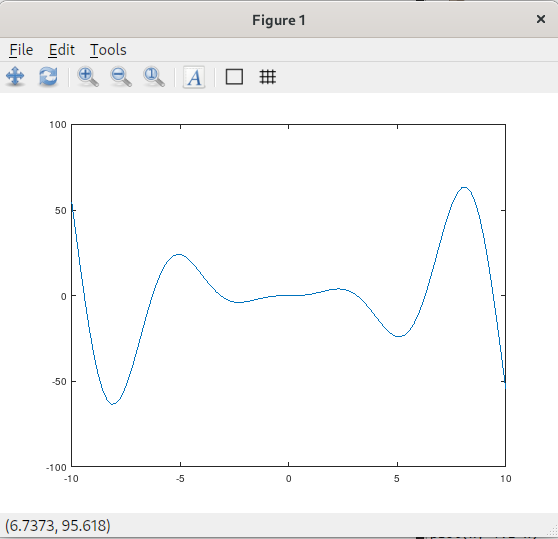{ #fig:045 width=70% }

- Сохраним графики в виде файлов (см. рис. 46).

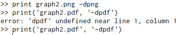{ #fig:046 width=70% }

**8. Сравнение циклов и операций с векторами**

- Сравним эффективность работы с циклами и операций с векторами. Для этого вычислим сумму 3.1 (см. рис. 47).

{ #fig:047 width=70% }

- Очистим память и рабочую область фигуры (см. рис. 48). Вычислим сумму с помощью цикла, создадим файл loop-for.m, функции tic и toc служат для запуска и остановки таймера (см. рис. 49).

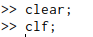{ #fig:048 width=70% }

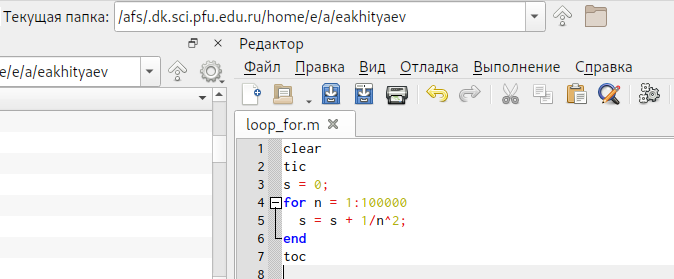{ #fig:049 width=70% }

- Запустим файл loop-for.m (см. рис. 50).

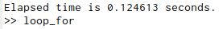{ #fig:050 width=70% }

- Вычислим сумму с помощью операций с векторами. Создадим файл loop-vec.m (см. рис. 51), запустим его (см. рис. 52).

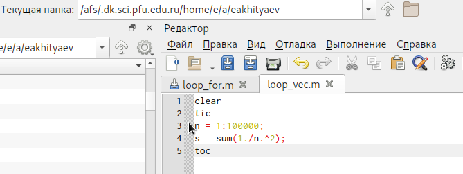{ #fig:051 width=70% }

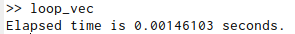{ #fig:052 width=70% }

Во втором случае сумма вычисляется значительно быстрее.

- Завершим запись в файл (см. рис. 53).

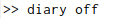{ #fig:053 width=70% }

# Выводы

В ходе выполнения работы я познакомился с некоторыми простейшими операциями в Octave.