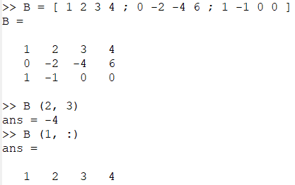
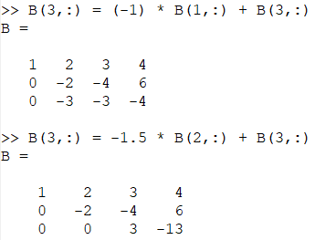
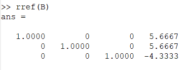
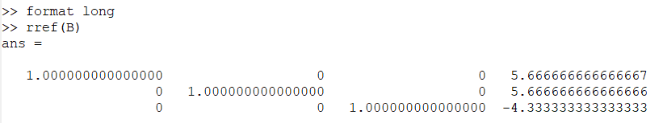
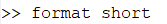
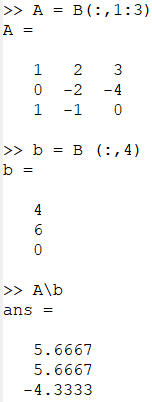
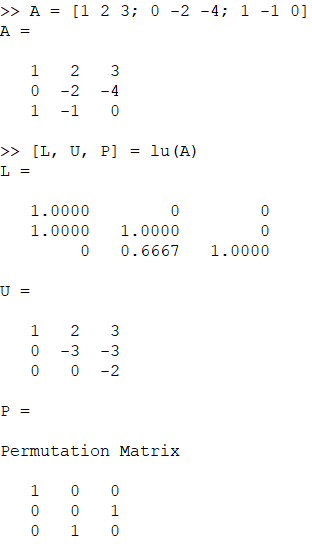

---
## Front matter
lang: ru-RU
title: Презентация по лабораторной работе №4. Системы линейных уравнений
author: Хитяев Евгений Анатольевич, НПМмд-02-21
institute: РУДН, Москва, Россия

date: 02 декабря 2021

## Formatting
mainfont: PT Serif
romanfont: PT Serif
sansfont: PT Sans
monofont: PT Mono
toc: false
slide_level: 2
theme: metropolis
header-includes: 
 - \metroset{progressbar=frametitle,sectionpage=progressbar,numbering=fraction}
 - '\makeatletter'
 - '\beamer@ignorenonframefalse'
 - '\makeatother'
aspectratio: 43
section-titles: true
---

# Лабораторная работа №4. Системы линейных уравнений.

Цель работы: Познакомиться с методами исследования систем линейных уравнений в Octave.

## Метод Гаусса. Матрица и некоторые операции с ней

Octave содержит сложные алгоритмы, встроенные для решения систем линейных уравнений.

- На скриншоте представлена расширенная матрица B, просмотр одного из ее элементов, а также извлеченный из матрицы B вектор строки.

{ #fig:001 width=40% }

## Метод Гаусса. Преобразование матрицы

- Реализуем теперь явно метод Гаусса.

{ #fig:002 width=40% }

Матрица теперь имеет треугольный вид. Ответ:  5.66667; 5.66667; -4.33333. Он был получен путем решения третьей строки матрицы, а впоследствии подставлением найденных элементов в другие строки матрицы.

## Метод Гаусса. Получение единичной матрицы

- Также этот ответ можно получить приведя матрицу к единичной (треугольной), цифры справа — это и будет ответ. Конечно, Octave располагает встроенной командой для непосредственного поиска треугольной формы матрицы, как это представлено на скриншоте.  

{ #fig:003 width=40% }

## Метод Гаусса. Различная запись дробных чисел

- Следует обратить внимание, что все числа записываются в виде десятичных дробей. Пять десятичных знаков отображаются по умолчанию. Переменные на самом деле хранятся с более высокой точностью — можно отобразить больше десятичных разрядов (см. скриншот).

{ #fig:004 width=45% }

- Предыдущий формат возвращается командой:

{ #fig:005 width=20% }

## Левое деление

Встроенная операция для решения линейных систем вида  
Ax = b в Octave называется левым делением и записывается как A обратный слэш b. Выделим из расширенной матрицы B матрицу A, вектор b, а затем найдем вектор х (см. скриншот).  

{ #fig:006 width=12% }

## LU-разложение

LU разложение – это вид факторизации матриц для метода Гаусса. Цель: записать матрицу А в виде: A = LU, где L – нижняя треугольная матрица, а U – верхняя. С помощью Octave можно расписать LU-разложение так, как представлено на скриншоте.

{ #fig:007 width=20% }

## Выводы

- В ходе выполнения работы я познакомился с некоторыми простейшими операциями в Octave.

