---
# Front matter
lang: ru-RU
title: "Лабораторная работа 4. Системы линейных уравнений"
subtitle: "Отчет по лабораторной работе 4"
author: "Хитяев Евгений Анатольевич НПМмд-02-21"

# Formatting
toc-title: "Содержание"
toc: true # Table of contents
toc_depth: 2
lof: true # List of figures
fontsize: 12pt
linestretch: 1.5
papersize: a4paper
documentclass: scrreprt
polyglossia-lang: russian
polyglossia-otherlangs: english
mainfont: PT Serif
romanfont: PT Serif
sansfont: PT Sans
monofont: PT Mono
mainfontoptions: Ligatures=TeX
romanfontoptions: Ligatures=TeX
sansfontoptions: Ligatures=TeX,Scale=MatchLowercase
monofontoptions: Scale=MatchLowercase
indent: true
pdf-engine: lualatex
header-includes:
  - \linepenalty=10 # the penalty added to the badness of each line within a paragraph (no associated penalty node) Increasing the value makes tex try to have fewer lines in the paragraph.
  - \interlinepenalty=0 # value of the penalty (node) added after each line of a paragraph.
  - \hyphenpenalty=50 # the penalty for line breaking at an automatically inserted hyphen
  - \exhyphenpenalty=50 # the penalty for line breaking at an explicit hyphen
  - \binoppenalty=700 # the penalty for breaking a line at a binary operator
  - \relpenalty=500 # the penalty for breaking a line at a relation
  - \clubpenalty=150 # extra penalty for breaking after first line of a paragraph
  - \widowpenalty=150 # extra penalty for breaking before last line of a paragraph
  - \displaywidowpenalty=50 # extra penalty for breaking before last line before a display math
  - \brokenpenalty=100 # extra penalty for page breaking after a hyphenated line
  - \predisplaypenalty=10000 # penalty for breaking before a display
  - \postdisplaypenalty=0 # penalty for breaking after a display
  - \floatingpenalty = 20000 # penalty for splitting an insertion (can only be split footnote in standard LaTeX)
  - \raggedbottom # or \flushbottom
  - \usepackage{float} # keep figures where there are in the text
  - \floatplacement{figure}{H} # keep figures where there are in the text
---

# Цель работы

Познакомиться с методами исследования систем линейных уравнений в Octave.

# Теоретические сведения

Вся теоритическая часть по выполнению лабораторной работы была взята из инструкции по лабораторной работе №4 ("Лабораторная работа №4. Описание") на сайте:
https://esystem.rudn.ru/course/view.php?id=12766

# Задание

Выполните работу и задокументируйте процесс выполнения.

# Выполнение лабораторной работы

**1. Метод Гаусса**

Octave содержит сложные алгоритмы, встроенные для решения систем линейных уравнений.

Для решения системы линейных уравнений:  
Ax = b  
методом Гаусса можно построить расширенную матрицу вида:  
B = (A|b).  
Рассмотрим расширенную матрицу (см. Fig. 1).  

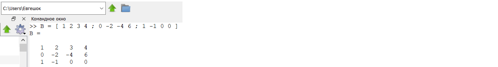{ #fig:001 width=70% }

Ее можно просматривать поэлементно (см. Fig. 2).  

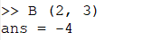{ #fig:002 width=70% }

Это скаляр, хранящийся в строке 2, столбце 3.  

Также можно извлечь целый вектор строки или вектор столбца, используя оператор сечения. Сечение можно использовать для указания ограниченного диапазона. Если не указано начальное или конечное значение, то результатом оператора является полный диапазон (см. Fig. 3).  

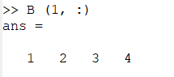{ #fig:003 width=70% }

Реализуем теперь явно метод Гаусса.  
Сначала добавим к третьей строке первую строку, умноженную на −1 (см. Fig. 4).  

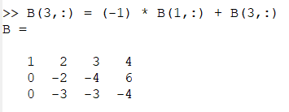{ #fig:004 width=70% }

Далее добавим к третьей строке вторую строку, умноженную на −1.5 (см. Fig. 5).  

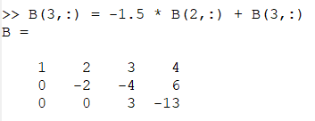{ #fig:005 width=70% }

Матрица теперь имеет треугольный вид. Очевидным образом получим ответ:  
5.66667; 5.66667; -4.33333  
Этот ответ был получен путем решения третьей строки матрицы, а впоследствии подставлением найденных элементов в другие строки матрицы. Либо этот ответ можно получить приведя матрицу к единичной (треугольной), цифры справа — это и есть ответ.  

Конечно, Octave располагает встроенной командой для непосредственного поиска треугольной формы матрицы. (см. Fig. 6).  

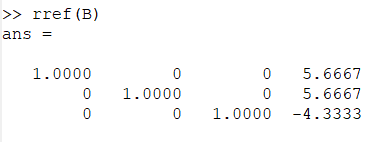{ #fig:006 width=70% }

Следует обратить внимание, что все числа записываются в виде чисел с плавающей точкой (то есть десятичных дробей). Пять десятичных знаков отображаются по умолчанию. Переменные на самом деле хранятся с более высокой точностью, и при желании можно отобразить больше десятичных разрядов. (см. Fig. 7).  

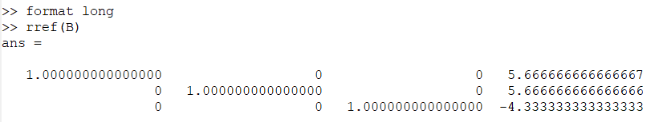{ #fig:007 width=70% }

Вернем предыдущий формат представления (см. Fig. 8).

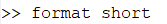{ #fig:008 width=70% }

**2. Левое деление**

Встроенная операция для решения линейных систем вида  
Ax = b  
в Octave называется левым делением и записывается как A\b. Выделим из расширенной матрицы B матрицу A, а также вектор b (см. Fig. 9).  

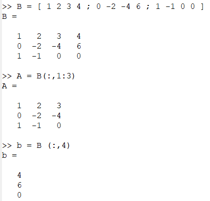{ #fig:009 width=70% }

После чего найдём вектор x (см. Fig. 10).  

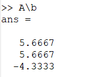{ #fig:010 width=70% }

**3. LU-разложение**

- LU-разложение:

LU разложение – это вид факторизации матриц для метода Гаусса. Цель состоит в том, чтобы записать матрицу A в виде:  
A = LU,  
где L – нижняя треугольная матрица, а U – верхняя треугольная матрица. Эта факторизованная форма может быть использована для решения уравнения Ax = b.  
LU-разложение существует только в том случае, когда матрица A обратима, а все главные миноры матрицы A невырождены. Этот метод является одной из разновидностей метода Гаусса.  

- Решение систем линейных уравнений:  

Если известно LU-разложение матрицы A, то исходная система может быть записана как:  
LUx = b.  
Эта система может быть решена в два шага. На первом шаге решается система:  
Ly = b.  
Поскольку L – нижняя треугольная матрица, эта система решается непосредственно прямой подстановкой.  

На втором шаге решается система:  
Ux = y.  
Поскольку U – верхняя треугольная матрица, эта система решается непосредственно обратной подстановкой.  

- Задание: 

Пусть дана матрица A (см. Fig. 11).  

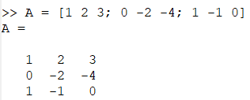{ #fig:011 width=70% }

С помощью Octave нужно расписать её LU-разложение.  
Распишем LU-разложение матрицы A (см. Fig. 12).  

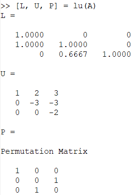{ #fig:012 width=70% }

# Выводы

В ходе выполнения лабораторной работы я познакомиться с методами исследования систем линейных уравнений в Octave.