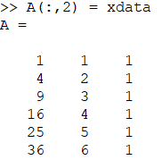
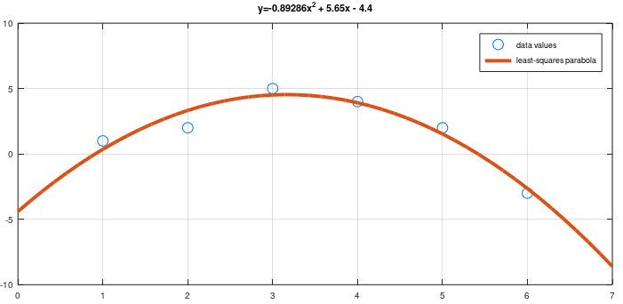
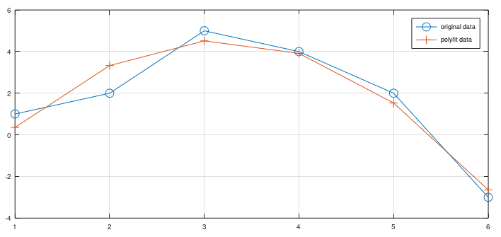
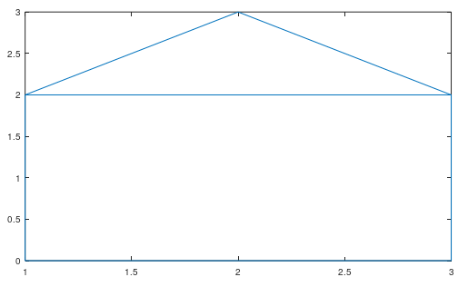
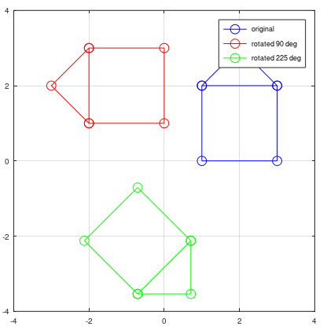
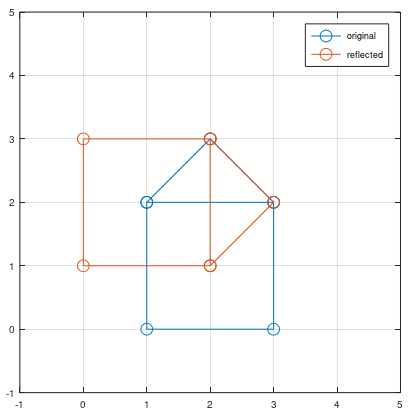
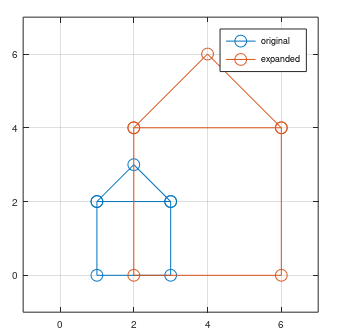

---
## Front matter
lang: ru-RU
title: Презентация по лабораторной работе №5.
author: Хитяев Евгений Анатольевич, НПМмд-02-21
institute: РУДН, Москва, Россия

date: 10 декабря 2021

## Formatting
mainfont: PT Serif
romanfont: PT Serif
sansfont: PT Sans
monofont: PT Mono
toc: false
slide_level: 2
theme: metropolis
header-includes: 
 - \metroset{progressbar=frametitle,sectionpage=progressbar,numbering=fraction}
 - '\makeatletter'
 - '\beamer@ignorenonframefalse'
 - '\makeatother'
aspectratio: 43
section-titles: true
---

# Лабораторная работа №5.

Цель работы: Ознакомиться с некоторыми операциями в среде Octave для решения таких задач, как подгонка полиномиальной кривой, матричных преобразований, вращений, отражений и дилатаций.

## Подгонка полиномиальной кривой

В статистике часто рассматривается проблема подгонки прямой линии к набору данных. Решим более общую проблему подгонки полинома к множеству точек. Пусть имеется матрица A:

$$
D =
\left(
\begin{array}{cc}
1 & 1 
\\ 
2 & 2 
\\
3 & 5
\\
4 & 4
\\
5 & 2
\\
6 & -3
\end{array}
\right)
$$

В матрице заданы значения $x$ в столбце 1 и значения $y$ в столбце 2.

## Подгонка полиномиальной кривой

Построим уравнение вида $y = ax^2 + bx + c$. Подставив значения матрицы А, получаем следующую систему линейных уравнений (Fig. 1).

$$
\left(
\begin{array}{ccc}
1 & 1 & 1
\\ 
4 & 2 & 1
\\
9 & 3 & 1
\\
16 & 4 & 1
\\
25 & 5 & 1
\\
36 & 6 & 1
\end{array}
\right)
\left(
\begin{array}{c}
a
\\ 
b
\\
c
\end{array}
\right)
=
\left(
\begin{array}{c}
1
\\ 
2
\\
5
\\
4
\\
2
\\
-3
\end{array}
\right).
$$  

Обратим внимание на форму матрицы коэффициентов $A$. 
Третий столбец – все единицы, второй столбец – значения $x$, а первый столбец – квадрат значений $x$.  Правый вектор – это значения $y$. 

## Подгонка полиномиальной кривой

Есть несколько способов построить матрицу коэффициентов в Octave. Один из подходов: использовать команду ones для создания матрицы единиц, а затем перезаписать 1-й и 2-й столбцы необходимыми данными. Результат показан на Fig. 1.

{ #fig:001 width=15% }

Решение по методу наименьших квадратов получается из решения уравнения $A^T Ab = A^T b$, где $b$ – вектор коэффициентов полинома.

## Подгонка полиномиальной кривой

Решим задачу методом Гаусса. После чего построим соответствующий график параболы (Fig. 2).

{ #fig:002 width=75% }

## Подгонка полиномиальной кривой

Процесс подгонки может быть автоматизирован встроенными функциями Octave. Для этого мы можем использовать встроенную функцию для подгонки полинома polyfit. После чего рассчитаем значения в точках и построим исходные данные (Fig. 3). 

{ #fig:003 width=55% }

## Матричные преобразования

Существует несколько способов представления изображения в виде матрицы. Один из них состоит в том, чтобы перечислить последовательно соединенные вершины, чтобы получить ребра простого графа. В качестве примера, закодируем граф-домик. Эффективный метод закодирования состоит в выборе пути, проходящем по каждому ребру ровно один раз (цикл Эйлера).

{ #fig:004 width=40% }

## Вращение

Вращения могут быть получены с использованием умножения на специальную матрицу. Вращение точки $(x, y)$ относительно начала координат определяется как  

$$
R
\left(
\begin{array}{c}
x
\\ 
y
\end{array}
\right),
$$

где

$$
R =
\left(
\begin{array}{cc}
cos(\theta) & -sin(\theta)
\\ 
sin(\theta) & cos(\theta)
\end{array}
\right),
$$  

$\theta$ - угол поворота (измеренный против часовой стрелки).

## Вращение

Теперь, чтобы произвести повороты матрицы данных $D$, нам нужно вычислить произведение матриц $RD$. Повернём граф дома на $90^{\circ}$ и $225^{\circ}$. Вначале переведём угол в радианы. Результаты показаны на скриншоте ниже.

{ #fig:005 width=40% }

## Отражение

Если $l$ – прямая, проходящая через начало координат, то отражение точки $(x, y)$ относительно прямой $l$ определяется как

$$
R
\left(
\begin{array}{c}
x
\\ 
y
\end{array}
\right),
$$

где

$$
R =
\left(
\begin{array}{cc}
cos(2\theta) & sin(2\theta)
\\ 
sin(2\theta) & -cos(2\theta)
\end{array}
\right),
$$

$\theta$ - угол между прямой $l$ и осью абсцисс (измеренный против часовой стрелки).
На скриншоте отражен граф дома относительно прямой $y = x$.

{ #fig:006 width=30% }

## Дилатация

Дилатация (расширение/сжатие) может выполняться умножением матриц. Если T - матрица со значениями k на главной диагонали, то матричное произведение $TD$ — преобразование дилатации $D$ с коэффициентом $k$. Увеличим граф дома в 2 раза (см. ниже). 

{ #fig:007 width=25% }

## Выводы

- В ходе выполнения лабораторной работы я ознакомился с некоторыми операциями в среде Octave для решения таких задач, как подгонка полиномиальной кривой, матричных преобразований, вращений, отражений и дилатаций.
