---
# Front matter
lang: ru-RU
title: "Лабораторная работа 5"
subtitle: "Отчет по лабораторной работе 5"
author: "Хитяев Евгений Анатольевич НПМмд-02-21"

# Formatting
toc-title: "Содержание"
toc: true # Table of contents
toc_depth: 2
lof: true # List of figures
fontsize: 12pt
linestretch: 1.5
papersize: a4paper
documentclass: scrreprt
polyglossia-lang: russian
polyglossia-otherlangs: english
mainfont: PT Serif
romanfont: PT Serif
sansfont: PT Sans
monofont: PT Mono
mainfontoptions: Ligatures=TeX
romanfontoptions: Ligatures=TeX
sansfontoptions: Ligatures=TeX,Scale=MatchLowercase
monofontoptions: Scale=MatchLowercase
indent: true
pdf-engine: lualatex
header-includes:
  - \linepenalty=10 # the penalty added to the badness of each line within a paragraph (no associated penalty node) Increasing the value makes tex try to have fewer lines in the paragraph.
  - \interlinepenalty=0 # value of the penalty (node) added after each line of a paragraph.
  - \hyphenpenalty=50 # the penalty for line breaking at an automatically inserted hyphen
  - \exhyphenpenalty=50 # the penalty for line breaking at an explicit hyphen
  - \binoppenalty=700 # the penalty for breaking a line at a binary operator
  - \relpenalty=500 # the penalty for breaking a line at a relation
  - \clubpenalty=150 # extra penalty for breaking after first line of a paragraph
  - \widowpenalty=150 # extra penalty for breaking before last line of a paragraph
  - \displaywidowpenalty=50 # extra penalty for breaking before last line before a display math
  - \brokenpenalty=100 # extra penalty for page breaking after a hyphenated line
  - \predisplaypenalty=10000 # penalty for breaking before a display
  - \postdisplaypenalty=0 # penalty for breaking after a display
  - \floatingpenalty = 20000 # penalty for splitting an insertion (can only be split footnote in standard LaTeX)
  - \raggedbottom # or \flushbottom
  - \usepackage{float} # keep figures where there are in the text
  - \floatplacement{figure}{H} # keep figures where there are in the text
---

# Цель работы

Ознакомиться с некоторыми операциями в среде Octave для решения таких задач, как подгонка полиномиальной кривой, матричных преобразований, вращений, отражений и дилатаций.

# Теоретические сведения

Вся теоритическая часть по выполнению лабораторной работы была взята из инструкции по лабораторной работе №5 ("Лабораторная работа №5. Описание") на сайте:
https://esystem.rudn.ru/course/view.php?id=12766

# Задание

Выполните работу и задокументируйте процесс выполнения.

# Выполнение лабораторной работы

**1. Подгонка полиномиальной кривой**

В статистике часто рассматривается проблема подгонки прямой линии к набору данных. Решим более общую проблему подгонки полинома к множеству точек. Пусть нам нужно найти параболу по методу наименьших квадратов для набора точек, заданных матрицей:  

$$
D =
\left(
\begin{array}{cc}
1 & 1 
\\ 
2 & 2 
\\
3 & 5
\\
4 & 4
\\
5 & 2
\\
6 & -3
\end{array}
\right)
$$

В матрице заданы значения $x$ в столбце 1 и значения $y$ в столбце 2.
Введём матрицу данных в Octave и извлечём вектора $x$ и $y$. Данные операции показаны на Fig. 1.

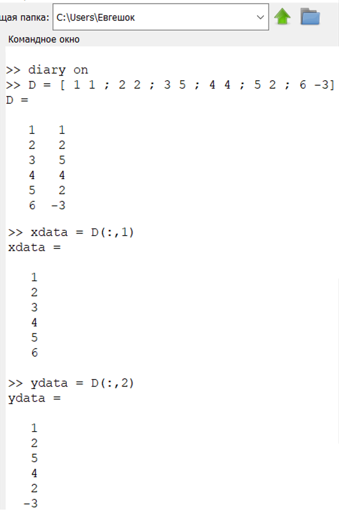{ #fig:001 width=70% }

Нарисуем точки на графике, см. Fig. 2.  

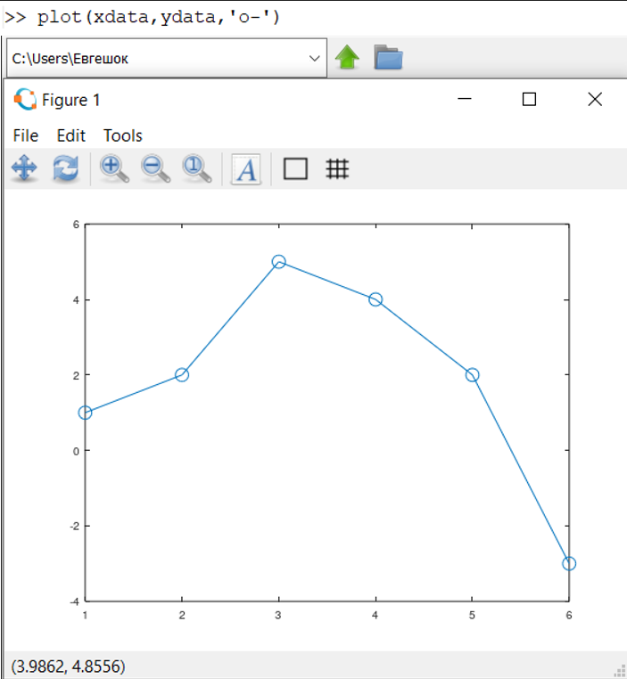{ #fig:002 width=70% }

Построим уравнение вида $y = ax^2 + bx + c$. Подставляя данные, получаем следующую систему линейных уравнений.  

$$
\left(
\begin{array}{ccc}
1 & 1 & 1
\\ 
4 & 2 & 1
\\
9 & 3 & 1
\\
16 & 4 & 1
\\
25 & 5 & 1
\\
36 & 6 & 1
\end{array}
\right)
\left(
\begin{array}{c}
a
\\ 
b
\\
c
\end{array}
\right)
=
\left(
\begin{array}{c}
1
\\ 
2
\\
5
\\
4
\\
2
\\
-3
\end{array}
\right).
$$  

Обратим внимание на форму матрицы коэффициентов $A$. 
Третий столбец – все единицы, второй столбец – значения $x$, а первый столбец – квадрат значений $x$.  Правый вектор – это значения $y$. Есть несколько способов построить матрицу коэффициентов в Octave. Один из подходов состоит в том, чтобы использовать команду ones для создания матрицы единиц соответствующего размера, а затем перезаписать первый и второй столбцы необходимыми данными. Это показано на  Fig. 3.

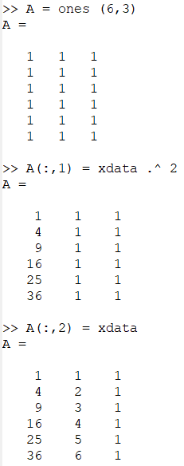{ #fig:003 width=70% }

Решение по методу наименьших квадратов получается из решения уравнения $A^T Ab = A^T b$, где $b$ – вектор коэффициентов полинома.
Используем Octave для построения уравнений, как показано на  Fig. 4

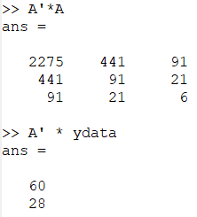{ #fig:004 width=70% }

Решим задачу методом Гаусса (См. Fig. 5). Для этого запишем расширенную матрицу:

$$
B =
\left(
\begin{array}{cccc}
2275 & 441 & 91 & 60 
\\ 
441 & 91 & 21 & 28 
\\
91 & 21 & 6 & 11
\end{array}
\right).
$$  

Таким образом, искомое квадратное уравнение имеет вид:

$$
y = -0.89286 x^2 + 5.65 x - 4.4
$$  

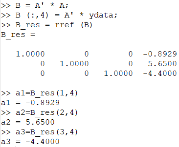{ #fig:005 width=70% }

После чего построим соответствующий график параболы. Построение можно увидеть на Figure 6, а вид самой параболы на Figure 7.

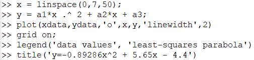{ #fig:006 width=70% }

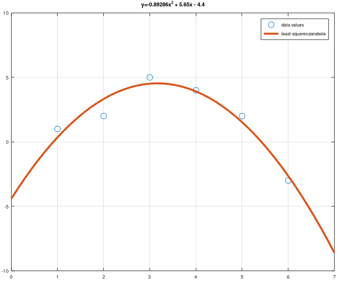{ #fig:007 width=70% }

Процесс подгонки может быть автоматизирован встроенными функциями Octave. Для этого мы можем использовать встроенную функцию для подгонки полинома polyfit. Синтаксис: polyfit (x, y, order), где order – это степень полинома. Значения полинома P в точках, задаваемых вектором-строкой x можно получить с помощью функции polyval. Синтаксис: polyval (P, x).

На Figure 8 получим подгоночный полином.  

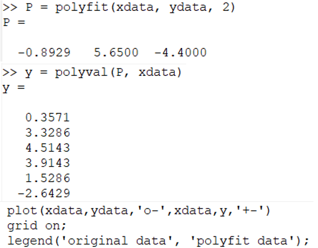{ #fig:008 width=70% }

После чего рассчитаем значения в точках и построим исходные данные. Это показано на Fig. 9.  

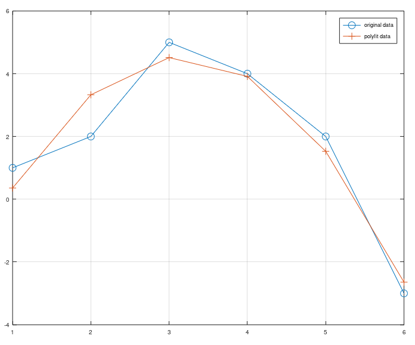{ #fig:009 width=70% }

**2. Матричные преобразования**

Матрицы и матричные преобразования играют ключевую роль в компьютерной графике. Существует несколько способов представления изображения в виде матрицы. Подход, который мы здесь используем, состоит в том, чтобы перечислить ряд вершин, которые соединены последовательно, чтобы получить ребра простого графа. Мы записываем это как матрицу $2 \times n$, где каждый столбец представляет точку на рисунке. В качестве простого примера, давайте попробуем закодировать граф-домик. Есть много способов закодировать это как матрицу. Эффективный метод состоит в том, чтобы выбрать путь, который проходит по каждому ребру ровно один раз (цикл Эйлера).  

$$
D =
\left(
\begin{array}{ccccccc}
1 & 1 & 3 & 3 & 2 & 1 & 3
\\ 
2 & 0 & 0 & 2 & 3 & 2 & 2
\end{array}
\right).
$$  

Реализация показана на Figure 10.

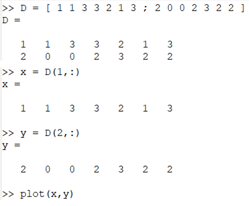{ #fig:010 width=70% }

Полученный граф можно увидеть на Figure 11.  

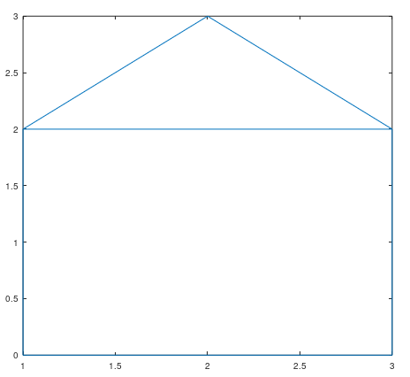{ #fig:011 width=70% }

**3. Вращение**

Рассмотрим различные способы преобразования изображения. 
Вращения могут быть получены с использованием умножения на специальную матрицу. Вращение точки $(x, y)$ относительно начала координат определяется как  

$$
R
\left(
\begin{array}{c}
x
\\ 
y
\end{array}
\right),
$$

где

$$
R =
\left(
\begin{array}{cc}
cos(\theta) & -sin(\theta)
\\ 
sin(\theta) & cos(\theta)
\end{array}
\right),
$$  

$\theta$ - угол поворота (измеренный против часовой стрелки).

Теперь, чтобы произвести повороты матрицы данных $D$, нам нужно вычислить произведение матриц $RD$. Повернём граф дома на $90^{\circ}$ и $225^{\circ}$. Вначале переведём угол в радианы. Произведенные действия показаны на Figure 12 - 14.

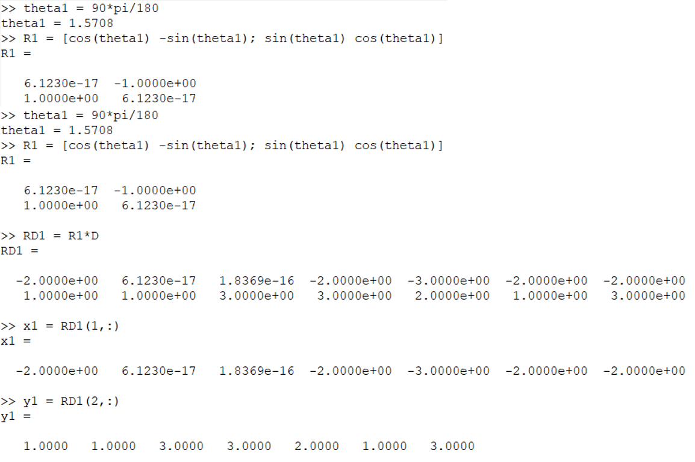{ #fig:012 width=70% }

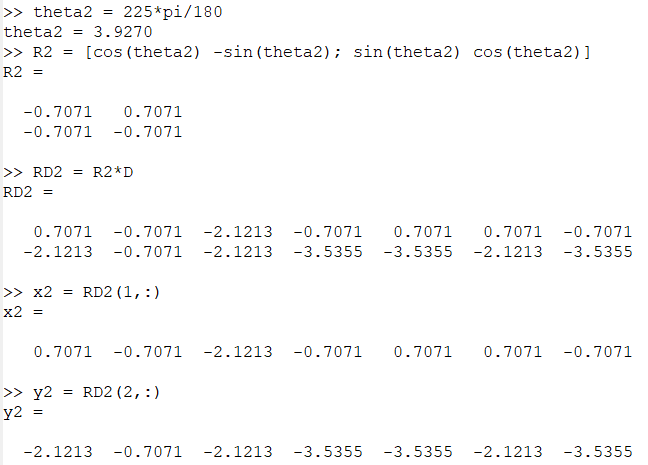{ #fig:013 width=70% }

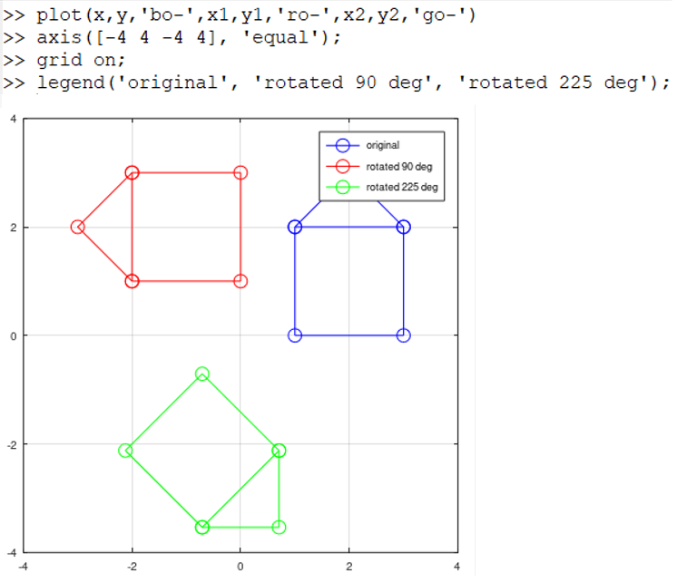{ #fig:014 width=70% }

**4. Отражение**

Если $l$ – прямая, проходящая через начало координат, то отражение точки $(x, y)$ относительно прямой $l$ определяется как

$$
R
\left(
\begin{array}{c}
x
\\ 
y
\end{array}
\right),
$$

где

$$
R =
\left(
\begin{array}{cc}
cos(2\theta) & sin(2\theta)
\\ 
sin(2\theta) & -cos(2\theta)
\end{array}
\right),
$$

$\theta$ - угол между прямой $l$ и осью абсцисс (измеренный против часовой стрелки).
Отразим граф дома относительно прямой $y = x$. Зададим матрицу отражения, как показано на Figure 15.

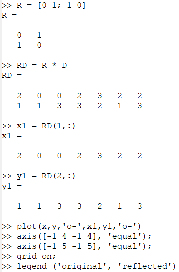{ #fig:015 width=70% }

Далее на Figure 16 показано, какой результат получился в ходе этих действий.  

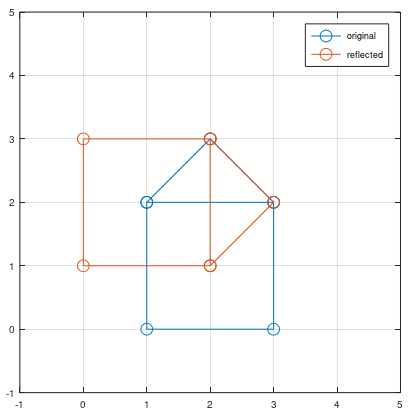{ #fig:016 width=70% }

**5. Дилатация**

Дилатация (то есть расширение или сжатие) также может быть выполнено путём умножения матриц. Пусть:  

$$
T =
\left(
\begin{array}{cc}
k & 0
\\ 
0 & k
\end{array}
\right),
$$  

Тогда матричное произведение $TD$ будет преобразованием дилатации $D$ с коэффициентом $k$. Увеличим граф дома в 2 раза. Реализация показана на Figure 17.  

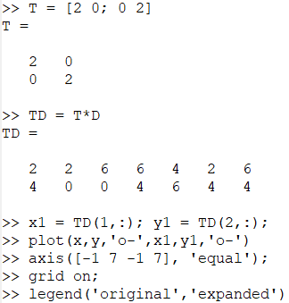{ #fig:017 width=70% }

После чего на Figure 18 можно увидеть результат данной операции.  

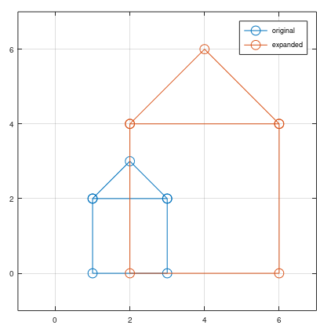{ #fig:018 width=70% }

# Выводы

В ходе выполнения лабораторной работы я ознакомился с некоторыми операциями в среде Octave для решения таких задач, как подгонка полиномиальной кривой, матричных преобразований, вращений, отражений и дилатаций.