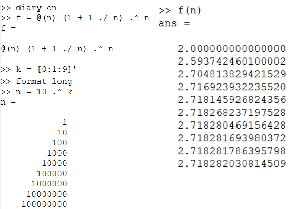
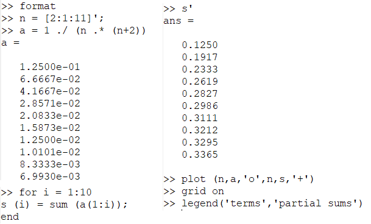
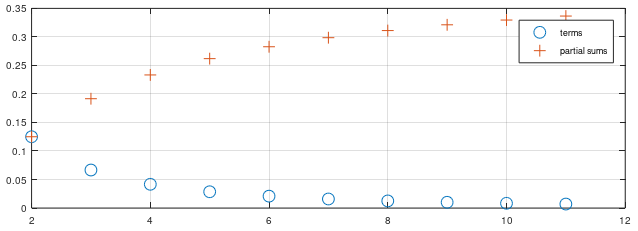
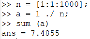
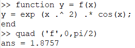
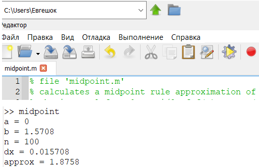
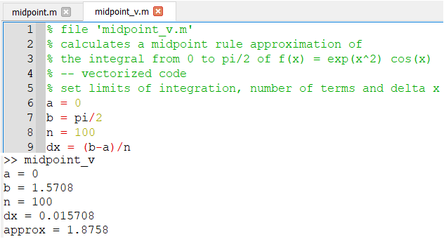
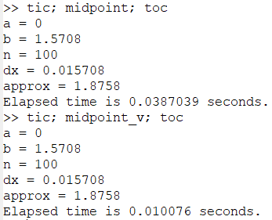

---
## Front matter
lang: ru-RU
title: Презентация по лабораторной работе №6.
author: Хитяев Евгений Анатольевич, НПМмд-02-21
institute: РУДН, Москва, Россия

date: 16 декабря 2021

## Formatting
mainfont: PT Serif
romanfont: PT Serif
sansfont: PT Sans
monofont: PT Mono
toc: false
slide_level: 2
theme: metropolis
header-includes: 
 - \metroset{progressbar=frametitle,sectionpage=progressbar,numbering=fraction}
 - '\makeatletter'
 - '\beamer@ignorenonframefalse'
 - '\makeatother'
aspectratio: 43
section-titles: true
---

# Лабораторная работа №6.

Цель работы: Научиться работать в Octave с пределами, последовательностями и рядами, а также научиться писать векторизованный программный код.  

## Пределы. Оценка

Определяем с помощью анонимной функции простую функцию. Создаём индексную переменную, возьмём степени 10, и оценим нашу функцию (см. скриншот)

{ #fig:001 width=70% }

## Частичные суммы

Определим индексный вектор, а затем вычислим члены. После чего введем последовательность частичных сумм, используя цикл. Показано на скриншоте.

{ #fig:002 width=70% }

## Частичные суммы

Построенные слагаемые и частичные суммы можно увидеть на скриншоте ниже.  

{ #fig:003 width=70% }

## Сумма ряда

Найдём сумму первых 1000 членов гармонического ряда 1/n. Действия показаны на скриншоте.  

{ #fig:004 width=70% }

## Вычисление интегралов

Численно посчитаем интеграл. Вычисления отображены на скриншоте.  

{ #fig:005 width=70% }

## Аппроксимирование суммами

Напишем скрипт для того, чтобы вычислить интеграл по правилу средней точки. Введём код в текстовый файл и назовём его midpoint.m. Запустим этот файл в командной строке. Выполненные действия представлены ниже.

{ #fig:006 width=70% }

## Аппроксимирование суммами

Теперь напишем векторизованный код, не требующий циклов. Для этого создадим вектор х-координат средних точек. Запустим этот файл в командной строке. Действия представлены на скриншоте.

{ #fig:007 width=70% }

## Аппроксимирование суммами

Запустим оба кода. Сравнение показано на ниже. 

{ #fig:008 width=70% }

Как мы видим, векторизованный код считает быстрее, так как в нём не использованы циклы, которые значительно замедляют работу программы.

## Выводы

- В ходе выполнения лабораторной работы я научился работать в Octave с пределами, последовательностями и рядами, а также научился писать векторизованный программный код. Более того, мне удалось определить, что векторизованный код работает существенно быстрее, чем код с циклами.
