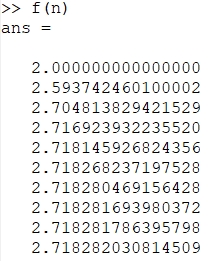

---
# Front matter
lang: ru-RU
title: "Лабораторная работа 6"
subtitle: "Отчет по лабораторной работе 6"
author: "Хитяев Евгений Анатольевич НПМмд-02-21"

# Formatting
toc-title: "Содержание"
toc: true # Table of contents
toc_depth: 2
lof: true # List of figures
fontsize: 12pt
linestretch: 1.5
papersize: a4paper
documentclass: scrreprt
polyglossia-lang: russian
polyglossia-otherlangs: english
mainfont: PT Serif
romanfont: PT Serif
sansfont: PT Sans
monofont: PT Mono
mainfontoptions: Ligatures=TeX
romanfontoptions: Ligatures=TeX
sansfontoptions: Ligatures=TeX,Scale=MatchLowercase
monofontoptions: Scale=MatchLowercase
indent: true
pdf-engine: lualatex
header-includes:
  - \linepenalty=10 # the penalty added to the badness of each line within a paragraph (no associated penalty node) Increasing the value makes tex try to have fewer lines in the paragraph.
  - \interlinepenalty=0 # value of the penalty (node) added after each line of a paragraph.
  - \hyphenpenalty=50 # the penalty for line breaking at an automatically inserted hyphen
  - \exhyphenpenalty=50 # the penalty for line breaking at an explicit hyphen
  - \binoppenalty=700 # the penalty for breaking a line at a binary operator
  - \relpenalty=500 # the penalty for breaking a line at a relation
  - \clubpenalty=150 # extra penalty for breaking after first line of a paragraph
  - \widowpenalty=150 # extra penalty for breaking before last line of a paragraph
  - \displaywidowpenalty=50 # extra penalty for breaking before last line before a display math
  - \brokenpenalty=100 # extra penalty for page breaking after a hyphenated line
  - \predisplaypenalty=10000 # penalty for breaking before a display
  - \postdisplaypenalty=0 # penalty for breaking after a display
  - \floatingpenalty = 20000 # penalty for splitting an insertion (can only be split footnote in standard LaTeX)
  - \raggedbottom # or \flushbottom
  - \usepackage{float} # keep figures where there are in the text
  - \floatplacement{figure}{H} # keep figures where there are in the text
---

# Цель работы
Научиться работать в Octave с пределами, последовательностями и рядами, а также научиться писать векторизованный программный код.  

# Теоретические сведения

Вся теоритическая часть по выполнению лабораторной работы была взята из инструкции по лабораторной работе №5 ("Лабораторная работа №6. Описание") на сайте:
https://esystem.rudn.ru/course/view.php?id=12766

# Задание

Выполните работу и задокументируйте процесс выполнения.

# Выполнение лабораторной работы

**1. Пределы. Оценка**

Определяем с помощью анонимной функции простую функцию. Создаём индексную переменную, возьмём степени 10, и оценим нашу функцию. Показано на Fig. 1.

{ #fig:001 width=70% }

Получим ответ. На Fig. 2 видно, что предел сходится к значению 2.71828.   

{ #fig:002 width=70% }

**2. Частичные суммы**

Определим индексный вектор, а затем вычислим члены. После чего введем последовательность частичных сумм, используя цикл. Показано на Fig .3  

{ #fig:003 width=70% }

Построенные слагаемые и частичные суммы можно увидеть на Fig. 4.  

{ #fig:004 width=70% }

**3. Сумма ряда**

Найдём сумму первых 1000 членов гармонического ряда 1/n. Действия показаны на Fig. 5.  

{ #fig:005 width=70% }

**4. Вычисление интегралов**

Численно посчитаем интеграл. См. Fig. 6.  

{ #fig:006 width=70% }

**5. Аппроксимирование суммами**

Напишем скрипт для того, чтобы вычислить интеграл по правилу средней точки. Введём код в текстовый файл и назовём его midpoint.m. Скрипт показан на Fig. 7.  

{ #fig:007 width=70% }

Запустим этот файл в командной строке. Вывод см. на Fig. 8  

{ #fig:008 width=70% }

Теперь напишем векторизованный код, не требующий циклов. Для этого создадим вектор х-координат средних точек. Показано на Fig. 9.  

{ #fig:009 width=70% }

Запустим этот файл в командной строке. Вывод см. на Fig. 10  

{ #fig:010 width=70% }

Запустив оба кода, можно заметить, что ответы совпадают, однако векторизованный код считает быстрее, так как в нём не использованы циклы, которые значительно замедляют работу программы. Сравнение показано на Fig. 11.  

{ #fig:011 width=70% }

# Выводы

В ходе выполнения лабораторной работы я научился работать в Octave с пределами, последовательностями и рядами, а также научился писать векторизованный программный код. Более того, мне удалось определить, что векторизованный код работает существенно быстрее, чем код с циклами.