---
## Front matter
lang: ru-RU
title: Презентация по лабораторной работе №7.
author: Хитяев Евгений Анатольевич, НПМмд-02-21
institute: РУДН, Москва, Россия

date: 22 декабря 2021

## Formatting
mainfont: PT Serif
romanfont: PT Serif
sansfont: PT Sans
monofont: PT Mono
toc: false
slide_level: 2
theme: metropolis
header-includes: 
 - \metroset{progressbar=frametitle,sectionpage=progressbar,numbering=fraction}
 - '\makeatletter'
 - '\beamer@ignorenonframefalse'
 - '\makeatother'
aspectratio: 43
section-titles: true
---

# Лабораторная работа №7.

Цель работы: Научиться строить различные виды графиков: параметрические, неявных функций, в полярных координатах. Обучиться работе с комплексными числами, изображать их на координатной плоскости.

## Параметрические графики

Включим журналирование. Построим график трёх периодов циклоиды радиуса 2. Для этого определим параметр как вектор в некотором диапазоне, затем вычислим x и y (см. ниже)

{ #fig:001 width=30% }

## Параметрические графики

Полученный график изображен на скриншоте.

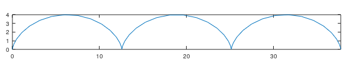{ #fig:002 width=70% }

## Полярные координаты

Графики в полярных координатах строятся аналогичным образом. Построим улитку Паскаля (см. скриншот).

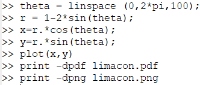{ #fig:003 width=30% }

Полученный график отображен ниже.

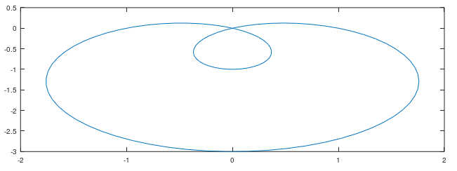{ #fig:004 width=30% }

## Полярные координаты

Более того, можно построить данный график в полярных осях (см. ниже).

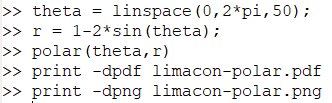{ #fig:005 width=30% }

{ #fig:006 width=30% }

## Графики неявных функций

Построим неявно определённую функцию с помощью ezplot. Используя лямбда-функцию, как показано на скриншоте, зададим график (см. второй скриншот).

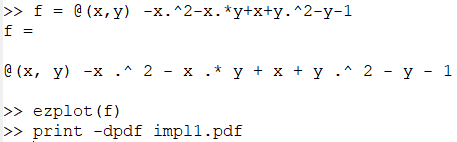{ #fig:007 width=40% }

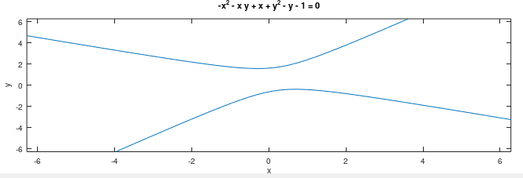{ #fig:008 width=40% }

## Графики неявных функций

Найдём уравнение касательной к некоторой окружности. Сначала построим круг, используя лямбда-функцию. Далее по правилу дифференцирования найдём уравнение касательной и изобразим ее на графике (см. скриншоты).

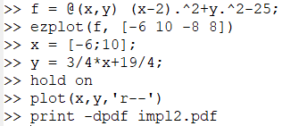{ #fig:009 width=30% }

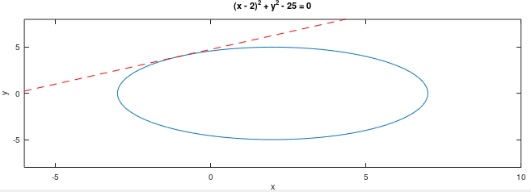{ #fig:010 width=35% }

## Комплексные числа

Зададим два комплексных числа и запишем основные арифметические операции с ними: сложение, вычитание, умножение, деление (Fig. 11). Построим графики в комплексной плоскости командой compass (Fig. 12).

{ #fig:011 width=15% }

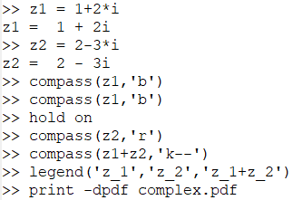{ #fig:012 width=20% }

## Комплексные числа

График показан на скриншоте.

{ #fig:013 width=50% }

## Комплексные числа

Иногда мы можем получить странные результаты вывода программы. При вычислении корня третьей степени из -8, мы ожидаем ответ -2, но получаем другое число. Это объясняется тем, что Octave возвращает тот ответ, у которого меньший аргумент. Для того, чтобы получить -2, мы должны использовать команду nthroot, как показано ниже.

{ #fig:014 width=30% }

## Специальные функции

Построим гамма-функцию Г(х+1) и n! на одном графике, как показано ниже.

{ #fig:015 width=30% }

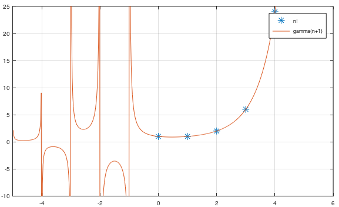{ #fig:016 width=30% }

## Специальные функции

Разделив область значения на отдельные интервалы, можно ввести команды и убрать артефакты вычислений (см. ниже).

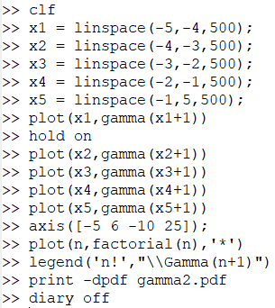{ #fig:017 width=15% }

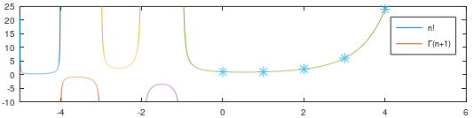{ #fig:018 width=30% }

## Выводы

- В ходе выполнения лабораторной работы я научился строить в Octave различные виды графиков: параметрические, неявных функций, в полярных координатах. Также поработал с комплексными числами, научился изображать их на координатной плоскости; построил гамма-функцию и график факториала.
